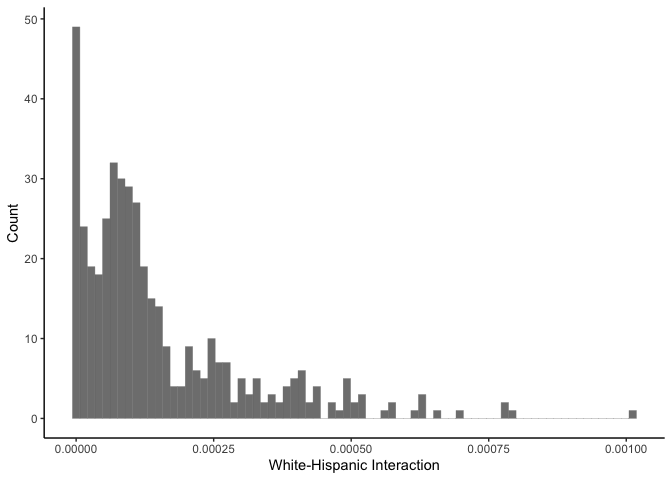

hw-2
================

## data

The first step in completing this problem set requires me to reformat
the provided data file, `hw02_ltdb_2010.dta`, into a csv that capable of
being read and mutated in RStudio.

To accomplish this, we’ll need to load a few packages.

``` r
library(haven)
library(tidyverse)
```

    ## ── Attaching packages ─────────────────────────────────────── tidyverse 1.3.2 ──
    ## ✔ ggplot2 3.3.6      ✔ purrr   0.3.4 
    ## ✔ tibble  3.1.8      ✔ dplyr   1.0.10
    ## ✔ tidyr   1.2.1      ✔ stringr 1.4.1 
    ## ✔ readr   2.1.2      ✔ forcats 0.5.2 
    ## ── Conflicts ────────────────────────────────────────── tidyverse_conflicts() ──
    ## ✖ dplyr::filter() masks stats::filter()
    ## ✖ dplyr::lag()    masks stats::lag()

``` r
library(dplyr)
```

Now, we can load the data into our environment:

``` r
hw02_ltdb_2010 <- read_dta("~/Downloads/hw02_ltdb_2010.dta")
```

## q1

The first question requires us to select one of the 100 largest CBSAs
given in the dataset, which is provided by the cbsasamp1 variable.

I chose the Milwaukee-Waukesha-West Allis, WI CBSA. Based on this
decision, let’s go ahead and mutate the dataframe that all rows
containing data outside this CBSA are removed.

``` r
milwaukee_cbsa <- hw02_ltdb_2010 %>% filter(cbsaname == "Milwaukee-Waukesha-West Allis, WI CBSA")
```

Now, we have to generate three tables describing this CBSA: one to
summarize the population characteristics, one to summarize relevant
neighborhood attributes, and one to quantify the levels of neighborhood
segregation.

### table 1

``` r
pop_characteristics <- read_csv("/Users/kenjinchang/github/pam6950/pop_characteristics.csv")
```

    ## Rows: 1 Columns: 17
    ## ── Column specification ────────────────────────────────────────────────────────
    ## Delimiter: ","
    ## dbl (17): num_persons, prop_asian, prop_black, prop_hisp, prop_white, num_as...
    ## 
    ## ℹ Use `spec()` to retrieve the full column specification for this data.
    ## ℹ Specify the column types or set `show_col_types = FALSE` to quiet this message.

``` r
print(as_tibble(pop_characteristics))
```

    ## # A tibble: 1 × 17
    ##   num_persons prop_asian prop_…¹ prop_…² prop_…³ num_a…⁴ num_b…⁵ num_h…⁶ num_w…⁷
    ##         <dbl>      <dbl>   <dbl>   <dbl>   <dbl>   <dbl>   <dbl>   <dbl>   <dbl>
    ## 1     1537741     0.0303   0.176  0.0959   0.698   46611  270518  147503 1073109
    ## # … with 8 more variables: num_pov <dbl>, rate_pov <dbl>,
    ## #   num_sing_parent <dbl>, num_households <dbl>, rate_sing_parent <dbl>,
    ## #   num_25_and_over_no_HS <dbl>, num_25_and_over <dbl>,
    ## #   prop_25_and_over_no_HS <dbl>, and abbreviated variable names ¹​prop_black,
    ## #   ²​prop_hisp, ³​prop_white, ⁴​num_asian, ⁵​num_black, ⁶​num_hisp, ⁷​num_white

### table 2

``` r
neighbor_attrib <- read_csv("/Users/kenjinchang/github/pam6950/neighbor_attrib.csv")
```

    ## Rows: 1 Columns: 57
    ## ── Column specification ────────────────────────────────────────────────────────
    ## Delimiter: ","
    ## dbl (57): num_neigh, neigh_mean_num_persons, neigh_sd_num_persons, neigh_min...
    ## 
    ## ℹ Use `spec()` to retrieve the full column specification for this data.
    ## ℹ Specify the column types or set `show_col_types = FALSE` to quiet this message.

``` r
print(as_tibble(neighbor_attrib))
```

    ## # A tibble: 1 × 57
    ##   num_neigh neigh_mean…¹ neigh…² neigh…³ neigh…⁴ neigh…⁵ neigh…⁶ neigh…⁷ neigh…⁸
    ##       <dbl>        <dbl>   <dbl>   <dbl>   <dbl>   <dbl>   <dbl>   <dbl>   <dbl>
    ## 1       431        3568.   1478.       0   2462.    3406   4486.    9412  0.0306
    ## # … with 48 more variables: neigh_sd_prop_asian <dbl>,
    ## #   neigh_min_prop_asian <dbl>, neigh_25_prop_asian <dbl>,
    ## #   neigh_med_prop_asian <dbl>, neigh_75_prop_asian <dbl>,
    ## #   neigh_max_prop_asian <dbl>, neigh_mean_prop_black <dbl>,
    ## #   neigh_sd_prop_black <dbl>, neigh_min_prop_black <dbl>,
    ## #   neigh_25_prop_black <dbl>, neigh_med_prop_black <dbl>,
    ## #   neigh_75_prop_black <dbl>, neigh_max_prop_black <dbl>, …

### table 3

``` r
neighbor_seg <- read_csv("/Users/kenjinchang/github/pam6950/neighbor_seg.csv")
```

    ## Rows: 1 Columns: 6
    ## ── Column specification ────────────────────────────────────────────────────────
    ## Delimiter: ","
    ## dbl (6): B_wxa, B_wxb, B_wxh, B_povxnopov, B_singparentxtwoparent, B_edlowxe...
    ## 
    ## ℹ Use `spec()` to retrieve the full column specification for this data.
    ## ℹ Specify the column types or set `show_col_types = FALSE` to quiet this message.

``` r
print(as_tibble(neighbor_seg))
```

    ## # A tibble: 1 × 6
    ##    B_wxa  B_wxb  B_wxh B_povxnopov B_singparentxtwoparent B_edlowxedother
    ##    <dbl>  <dbl>  <dbl>       <dbl>                  <dbl>           <dbl>
    ## 1 0.0276 0.0598 0.0645       0.711                  0.167           0.789

## q2

For this portion, I’ve created a dedicated dataframe to capture the
distribution in tract-level exposure index values, both for White- and
Hispanic-identifying individuals in the Milwaukee CBSA and for
poverty-stricken and non-poverty-stricken individuals.

``` r
q2 <- read_csv("/Users/kenjinchang/github/pam6950/q2.csv")
```

    ## Rows: 431 Columns: 3
    ## ── Column specification ────────────────────────────────────────────────────────
    ## Delimiter: ","
    ## dbl (3): tract, whitexhispanic, povxnopov
    ## 
    ## ℹ Use `spec()` to retrieve the full column specification for this data.
    ## ℹ Specify the column types or set `show_col_types = FALSE` to quiet this message.

``` r
ggplot(q2,aes(x=whitexhispanic)) +
  geom_histogram(bins=75,color="gray50",size=.1,alpha=.8) +
  xlab("White-Hispanic Interaction") +
  ylab("Count") +
  theme_classic()
```

<!-- -->

``` r
ggplot(q2,aes(x=povxnopov)) +
  geom_histogram(bins=75,color="gray50",size=.1,alpha=.8) +
  xlab("Poverty-No Poverty Interaction") +
  ylab("Count") +
  theme_classic()
```

<!-- -->

## q3

Still merging…

## q4

``` r
library(choroplethr)
```

    ## Loading required package: acs

    ## Loading required package: XML

    ## 
    ## Attaching package: 'acs'

    ## The following object is masked from 'package:dplyr':
    ## 
    ##     combine

    ## The following object is masked from 'package:base':
    ## 
    ##     apply

``` r
library(choroplethrZip)
library(ggplot2)
library(tmap)
library(tidycensus)
```

``` r
medincome <- get_acs(
  geography="tract",
  variables="B19013_001",
  state="WI",
  geometry=TRUE,
  year=2020)
```

    ## Getting data from the 2016-2020 5-year ACS

    ## Warning: • You have not set a Census API key. Users without a key are limited to 500
    ## queries per day and may experience performance limitations.
    ## ℹ For best results, get a Census API key at http://api.census.gov/data/
    ## key_signup.html and then supply the key to the `census_api_key()` function to
    ## use it throughout your tidycensus session.
    ## This warning is displayed once per session.

    ## Downloading feature geometry from the Census website.  To cache shapefiles for use in future sessions, set `options(tigris_use_cache = TRUE)`.

    ##   |                                                                              |                                                                      |   0%  |                                                                              |=                                                                     |   1%  |                                                                              |=                                                                     |   2%  |                                                                              |==                                                                    |   2%  |                                                                              |==                                                                    |   3%  |                                                                              |==                                                                    |   4%  |                                                                              |===                                                                   |   4%  |                                                                              |===                                                                   |   5%  |                                                                              |====                                                                  |   5%  |                                                                              |====                                                                  |   6%  |                                                                              |=====                                                                 |   7%  |                                                                              |======                                                                |   9%  |                                                                              |=======                                                               |  10%  |                                                                              |========                                                              |  11%  |                                                                              |==========                                                            |  14%  |                                                                              |==========                                                            |  15%  |                                                                              |===========                                                           |  15%  |                                                                              |=============                                                         |  18%  |                                                                              |==============                                                        |  20%  |                                                                              |================                                                      |  23%  |                                                                              |=================                                                     |  24%  |                                                                              |=================                                                     |  25%  |                                                                              |====================                                                  |  29%  |                                                                              |======================                                                |  32%  |                                                                              |=========================                                             |  36%  |                                                                              |=================================                                     |  47%  |                                                                              |===========================================                           |  62%  |                                                                              |================================================                      |  68%  |                                                                              |=================================================                     |  70%  |                                                                              |======================================================                |  77%  |                                                                              |=======================================================               |  79%  |                                                                              |=================================================================     |  94%  |                                                                              |======================================================================| 100%

``` r
plot(medincome["estimate"])
```

<!-- -->

Saving for now…
