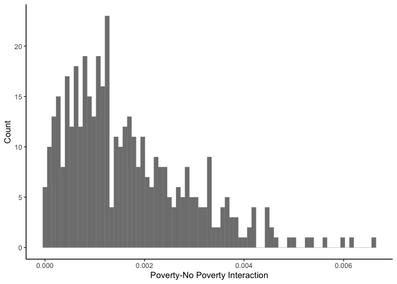

hw-2
================

## data

The first step in completing this problem set requires me to reformat
the provided data file, `hw02_ltdb_2010.dta`, into a csv that capable of
being read and mutated in RStudio.

To accomplish this, we’ll need to load a few packages.

``` r
library(haven)
library(tidyverse)
```

    ## ── Attaching packages ─────────────────────────────────────── tidyverse 1.3.2 ──
    ## ✔ ggplot2 3.3.6      ✔ purrr   0.3.4 
    ## ✔ tibble  3.1.8      ✔ dplyr   1.0.10
    ## ✔ tidyr   1.2.1      ✔ stringr 1.4.1 
    ## ✔ readr   2.1.2      ✔ forcats 0.5.2 
    ## ── Conflicts ────────────────────────────────────────── tidyverse_conflicts() ──
    ## ✖ dplyr::filter() masks stats::filter()
    ## ✖ dplyr::lag()    masks stats::lag()

``` r
library(dplyr)
```

Now, we can load the data into our environment:

``` r
hw02_ltdb_2010 <- read_dta("~/Downloads/hw02_ltdb_2010.dta")
```

## q1

The first question requires us to select one of the 100 largest CBSAs
given in the dataset, which is provided by the cbsasamp1 variable.

I chose the Milwaukee-Waukesha-West Allis, WI CBSA. Based on this
decision, let’s go ahead and mutate the dataframe that all rows
containing data outside this CBSA are removed.

``` r
milwaukee_cbsa <- hw02_ltdb_2010 %>% filter(cbsaname == "Milwaukee-Waukesha-West Allis, WI CBSA")
```

Now, we have to generate three tables describing this CBSA: one to
summarize the population characteristics, one to summarize relevant
neighborhood attributes, and one to quantify the levels of neighborhood
segregation.

### table 1

``` r
pop_characteristics <- read_csv("/Users/kenjinchang/github/pam6950/pop_characteristics.csv")
```

    ## Rows: 1 Columns: 17
    ## ── Column specification ────────────────────────────────────────────────────────
    ## Delimiter: ","
    ## dbl (17): num_persons, prop_asian, prop_black, prop_hisp, prop_white, num_as...
    ## 
    ## ℹ Use `spec()` to retrieve the full column specification for this data.
    ## ℹ Specify the column types or set `show_col_types = FALSE` to quiet this message.

``` r
print(as_tibble(pop_characteristics))
```

    ## # A tibble: 1 × 17
    ##   num_persons prop_asian prop_…¹ prop_…² prop_…³ num_a…⁴ num_b…⁵ num_h…⁶ num_w…⁷
    ##         <dbl>      <dbl>   <dbl>   <dbl>   <dbl>   <dbl>   <dbl>   <dbl>   <dbl>
    ## 1     1537741     0.0303   0.176  0.0959   0.698   46611  270518  147503 1073109
    ## # … with 8 more variables: num_pov <dbl>, rate_pov <dbl>,
    ## #   num_sing_parent <dbl>, num_households <dbl>, rate_sing_parent <dbl>,
    ## #   num_25_and_over_no_HS <dbl>, num_25_and_over <dbl>,
    ## #   prop_25_and_over_no_HS <dbl>, and abbreviated variable names ¹​prop_black,
    ## #   ²​prop_hisp, ³​prop_white, ⁴​num_asian, ⁵​num_black, ⁶​num_hisp, ⁷​num_white

### table 2

``` r
neighbor_attrib <- read_csv("/Users/kenjinchang/github/pam6950/neighbor_attrib.csv")
```

    ## Rows: 1 Columns: 57
    ## ── Column specification ────────────────────────────────────────────────────────
    ## Delimiter: ","
    ## dbl (57): num_neigh, neigh_mean_num_persons, neigh_sd_num_persons, neigh_min...
    ## 
    ## ℹ Use `spec()` to retrieve the full column specification for this data.
    ## ℹ Specify the column types or set `show_col_types = FALSE` to quiet this message.

``` r
print(as_tibble(neighbor_attrib))
```

    ## # A tibble: 1 × 57
    ##   num_neigh neigh_mean…¹ neigh…² neigh…³ neigh…⁴ neigh…⁵ neigh…⁶ neigh…⁷ neigh…⁸
    ##       <dbl>        <dbl>   <dbl>   <dbl>   <dbl>   <dbl>   <dbl>   <dbl>   <dbl>
    ## 1       431        3568.   1478.       0   2462.    3406   4486.    9412  0.0306
    ## # … with 48 more variables: neigh_sd_prop_asian <dbl>,
    ## #   neigh_min_prop_asian <dbl>, neigh_25_prop_asian <dbl>,
    ## #   neigh_med_prop_asian <dbl>, neigh_75_prop_asian <dbl>,
    ## #   neigh_max_prop_asian <dbl>, neigh_mean_prop_black <dbl>,
    ## #   neigh_sd_prop_black <dbl>, neigh_min_prop_black <dbl>,
    ## #   neigh_25_prop_black <dbl>, neigh_med_prop_black <dbl>,
    ## #   neigh_75_prop_black <dbl>, neigh_max_prop_black <dbl>, …

### table 3

``` r
neighbor_seg <- read_csv("/Users/kenjinchang/github/pam6950/neighbor_seg.csv")
```

    ## Rows: 1 Columns: 6
    ## ── Column specification ────────────────────────────────────────────────────────
    ## Delimiter: ","
    ## dbl (6): B_wxa, B_wxb, B_wxh, B_povxnopov, B_singparentxtwoparent, B_edlowxe...
    ## 
    ## ℹ Use `spec()` to retrieve the full column specification for this data.
    ## ℹ Specify the column types or set `show_col_types = FALSE` to quiet this message.

``` r
print(as_tibble(neighbor_seg))
```

    ## # A tibble: 1 × 6
    ##    B_wxa  B_wxb  B_wxh B_povxnopov B_singparentxtwoparent B_edlowxedother
    ##    <dbl>  <dbl>  <dbl>       <dbl>                  <dbl>           <dbl>
    ## 1 0.0276 0.0598 0.0645       0.711                  0.167           0.789

## q2

For this portion, I’ve created a dedicated dataframe to capture the
distribution in tract-level exposure index values, both for White- and
Hispanic-identifying individuals in the Milwaukee CBSA and for
poverty-stricken and non-poverty-stricken individuals.

``` r
q2 <- read_csv("/Users/kenjinchang/github/pam6950/q2.csv")
```

    ## Rows: 431 Columns: 3
    ## ── Column specification ────────────────────────────────────────────────────────
    ## Delimiter: ","
    ## dbl (3): tract, whitexhispanic, povxnopov
    ## 
    ## ℹ Use `spec()` to retrieve the full column specification for this data.
    ## ℹ Specify the column types or set `show_col_types = FALSE` to quiet this message.

``` r
ggplot(q2,aes(x=whitexhispanic)) +
  geom_histogram(bins=75,color="gray50",size=.1,alpha=.8) +
  xlab("White-Hispanic Interaction") +
  ylab("Count") +
  theme_classic()
```

<!-- -->

``` r
ggplot(q2,aes(x=povxnopov)) +
  geom_histogram(bins=75,color="gray50",size=.1,alpha=.8) +
  xlab("Poverty-No Poverty Interaction") +
  ylab("Count") +
  theme_classic()
```

<!-- -->

## q3

Still merging…

## q4

``` r
library(choroplethr)
```

    ## Loading required package: acs

    ## Loading required package: XML

    ## 
    ## Attaching package: 'acs'

    ## The following object is masked from 'package:dplyr':
    ## 
    ##     combine

    ## The following object is masked from 'package:base':
    ## 
    ##     apply

``` r
library(choroplethrZip)
library(ggplot2)
library(tmap)
library(tidycensus)
```

Experimenting with tidycensus:

``` r
medincome <- get_acs(
  geography="tract",
  variables="B19013_001",
  state="WI",
  geometry=TRUE,
  year=2020)
```

    ## Getting data from the 2016-2020 5-year ACS

    ## Warning: • You have not set a Census API key. Users without a key are limited to 500
    ## queries per day and may experience performance limitations.
    ## ℹ For best results, get a Census API key at http://api.census.gov/data/
    ## key_signup.html and then supply the key to the `census_api_key()` function to
    ## use it throughout your tidycensus session.
    ## This warning is displayed once per session.

    ## Downloading feature geometry from the Census website.  To cache shapefiles for use in future sessions, set `options(tigris_use_cache = TRUE)`.

    ##   |                                                                              |                                                                      |   0%  |                                                                              |=                                                                     |   1%  |                                                                              |=                                                                     |   2%  |                                                                              |====                                                                  |   5%  |                                                                              |=====                                                                 |   7%  |                                                                              |======                                                                |   9%  |                                                                              |=======                                                               |  10%  |                                                                              |=========                                                             |  12%  |                                                                              |==========                                                            |  14%  |                                                                              |===========                                                           |  16%  |                                                                              |============                                                          |  17%  |                                                                              |==============                                                        |  19%  |                                                                              |==============                                                        |  20%  |                                                                              |===============                                                       |  22%  |                                                                              |================                                                      |  23%  |                                                                              |=================                                                     |  24%  |                                                                              |====================                                                  |  28%  |                                                                              |====================                                                  |  29%  |                                                                              |=======================                                               |  33%  |                                                                              |==========================                                            |  37%  |                                                                              |==========================                                            |  38%  |                                                                              |============================                                          |  41%  |                                                                              |=============================                                         |  42%  |                                                                              |==============================                                        |  42%  |                                                                              |==============================                                        |  43%  |                                                                              |=================================                                     |  48%  |                                                                              |==================================                                    |  48%  |                                                                              |======================================                                |  54%  |                                                                              |==========================================                            |  60%  |                                                                              |===========================================                           |  62%  |                                                                              |================================================                      |  68%  |                                                                              |===================================================                   |  72%  |                                                                              |======================================================                |  77%  |                                                                              |=================================================================     |  93%  |                                                                              |===================================================================   |  96%  |                                                                              |======================================================================| 100%

``` r
plot(medincome["estimate"])
```

<!-- -->

Experimenting with ggplot2:

``` r
ggplot(medincome,aes(fill=estimate)) + 
  geom_sf() + 
  scale_fill_distiller(palette="RdPu",
                       direction=1) + 
  labs(title="Median Household Income by Tract, 2020",
       caption="Data Source: 2015-2020 ACS, US Census Bureau",
       fill="ACS Estimate") + 
  theme_void()
```

<!-- --> Experimenting
with tmap:

``` r
milwaukee_race <- get_decennial(
  geography="tract",
  state="WI",
  county=c(
    "Dodge",
    "Jefferson",
    "Milwaukee",
    "Ozaukee",
    "Racine",
    "Walworth",
    "Washington",
    "Waukesha"),
  variables=c(
    Hispanic="P2_002N",
    White="P2_005N",
    Black="P2_006N",
    Asian="P2_008N"),
  summary_var="P2_001N",
  year=2020,geometry=TRUE
) %>% mutate(percent=100*(value/summary_value))
```

    ## Getting data from the 2020 decennial Census

    ## Downloading feature geometry from the Census website.  To cache shapefiles for use in future sessions, set `options(tigris_use_cache = TRUE)`.

    ## Using the PL 94-171 Redistricting Data summary file

    ## Note: 2020 decennial Census data use differential privacy, a technique that
    ## introduces errors into data to preserve respondent confidentiality.
    ## ℹ Small counts should be interpreted with caution.
    ## ℹ See https://www.census.gov/library/fact-sheets/2021/protecting-the-confidentiality-of-the-2020-census-redistricting-data.html for additional guidance.
    ## This message is displayed once per session.

``` r
milwaukee_black <- filter(milwaukee_race,
                          variable=="Black")
```

``` r
milwaukee_black[is.na(milwaukee_black)] <- 1
lapply(milwaukee_black,na.omit)
```

    ## $GEOID
    ##   [1] "55089620100" "55089650102" "55131420402" "55133201203" "55133200700"
    ##   [6] "55133201800" "55079009600" "55079004900" "55079013500" "55079002100"
    ##  [11] "55079006500" "55079018400" "55079003000" "55079187300" "55079100600"
    ##  [16] "55079015800" "55079002500" "55079001900" "55079185800" "55079018900"
    ##  [21] "55079018700" "55079019200" "55079130200" "55079060102" "55079016000"
    ##  [26] "55101002402" "55101000904" "55101002701" "55055100500" "55079013300"
    ##  [31] "55079009800" "55079186000" "55131470204" "55101001101" "55133203105"
    ##  [36] "55133203107" "55079160101" "55079160102" "55133200101" "55133203304"
    ##  [41] "55133201504" "55133202700" "55089650200" "55131400103" "55079014900"
    ##  [46] "55079006600" "55079002600" "55079090300" "55079009500" "55079009900"
    ##  [51] "55079185700" "55079008000" "55079011400" "55079012800" "55079170500"
    ##  [56] "55079009400" "55079160203" "55079100400" "55079009200" "55079005000"
    ##  [61] "55079005100" "55079001000" "55079013000" "55079006200" "55079012200"
    ##  [66] "55079021000" "55079021300" "55079186600" "55079016800" "55079021500"
    ##  [71] "55079013600" "55079186100" "55079014600" "55079170400" "55079014800"
    ##  [76] "55127000501" "55101001505" "55101000903" "55101000700" "55079185900"
    ##  [81] "55133201201" "55055101300" "55027960900" "55055100301" "55101001507"
    ##  [86] "55133201508" "55133203501" "55133201204" "55127000303" "55079160301"
    ##  [91] "55089660303" "55131460102" "55133203602" "55133201404" "55079050101"
    ##  [96] "55079004800" "55079009000" "55079007600" "55079100300" "55079003300"
    ## [101] "55079018300" "55101000200" "55133202203" "55055101702" "55127000802"
    ## [106] "55101001506" "55133200102" "55027961900" "55079120502" "55079013700"
    ## [111] "55079021100" "55079008100" "55079170300" "55101002401" "55101001002"
    ## [116] "55101001706" "55131470202" "55133204301" "55133201507" "55079186200"
    ## [121] "55079007200" "55079017300" "55079018600" "55055100200" "55133203405"
    ## [126] "55127000104" "55079005200" "55079021400" "55079012600" "55079015700"
    ## [131] "55079001300" "55079101300" "55079180500" "55079101000" "55079002900"
    ## [136] "55127001603" "55133202500" "55133203104" "55079160206" "55079100800"
    ## [141] "55101980000" "55133203402" "55131470203" "55133201505" "55133200103"
    ## [146] "55079090800" "55079001800" "55079016400" "55101001702" "55027960800"
    ## [151] "55089650103" "55101001401" "55079187000" "55079160205" "55079005500"
    ## [156] "55133202303" "55079101700" "55079005300" "55079020400" "55079017200"
    ## [161] "55079080400" "55079018200" "55079021800" "55079170700" "55101001501"
    ## [166] "55101001301" "55133203404" "55079014400" "55079100700" "55079003900"
    ## [171] "55133203103" "55079008500" "55079004000" "55089630201" "55089630202"
    ## [176] "55133201900" "55133202901" "55133200400" "55133202102" "55133203601"
    ## [181] "55133204302" "55133204501" "55133200804" "55133200803" "55133201600"
    ## [186] "55133202800" "55133204004" "55133201701" "55131420106" "55131420401"
    ## [191] "55131440105" "55089660202" "55089650300" "55079018500" "55079060200"
    ## [196] "55079003100" "55079040100" "55079120501" "55079011300" "55079003700"
    ## [201] "55079008900" "55079006300" "55079004600" "55079101500" "55079091400"
    ## [206] "55079101400" "55079012400" "55079006400" "55079008600" "55079006800"
    ## [211] "55079019900" "55079020900" "55079120102" "55079001200" "55079007300"
    ## [216] "55079007500" "55079187200" "55079091300" "55079015900" "55079185300"
    ## [221] "55079000304" "55079001100" "55079101100" "55079018100" "55079120300"
    ## [226] "55079010700" "55079180200" "55079100100" "55079035200" "55079001400"
    ## [231] "55079185100" "55079018800" "55079186500" "55079080100" "55079006900"
    ## [236] "55079017500" "55079019800" "55079002400" "55079180100" "55079007700"
    ## [241] "55101001601" "55101000800" "55101001703" "55101001003" "55101001801"
    ## [246] "55127001702" "55127000102" "55055101701" "55055101202" "55027960400"
    ## [251] "55027960100" "55027961300" "55133201703" "55133200801" "55131450105"
    ## [256] "55131450103" "55079007400" "55079000101" "55079186900" "55079980000"
    ## [261] "55079008800" "55101002001" "55101002900" "55131420107" "55089640101"
    ## [266] "55089650104" "55127000201" "55127000202" "55133204201" "55133203308"
    ## [271] "55133201102" "55133200300" "55133204400" "55133202201" "55133200202"
    ## [276] "55133200902" "55133203702" "55133203802" "55133204002" "55133203305"
    ## [281] "55133201402" "55089660201" "55089660301" "55089660304" "55131410100"
    ## [286] "55131400102" "55131420104" "55131440104" "55133203406" "55079070300"
    ## [291] "55079100200" "55079004700" "55079101600" "55079150301" "55079020700"
    ## [296] "55079019100" "55079100900" "55079186400" "55079160202" "55079091100"
    ## [301] "55079002000" "55079000303" "55079000900" "55079005800" "55079000600"
    ## [306] "55079003500" "55079005600" "55079016200" "55079008400" "55079004500"
    ## [311] "55079012300" "55079004100" "55079185200" "55079170200" "55079014700"
    ## [316] "55079185400" "55079030100" "55079016900" "55079016500" "55079020300"
    ## [321] "55079000400" "55079004300" "55079005900" "55079090700" "55079002200"
    ## [326] "55079021600" "55079006100" "55079002700" "55079090100" "55079016600"
    ## [331] "55079090200" "55079009300" "55079009100" "55079009700" "55079008700"
    ## [336] "55079021200" "55079007000" "55079180300" "55079011000" "55079007100"
    ## [341] "55079003800" "55079020800" "55079000700" "55079000201" "55079010800"
    ## [346] "55079017000" "55079091200" "55079186300" "55079180400" "55079101800"
    ## [351] "55079170100" "55079130100" "55079017400" "55079019300" "55079002800"
    ## [356] "55079140100" "55127001000" "55127000600" "55127001501" "55101001202"
    ## [361] "55101002600" "55101001602" "55101000901" "55101001001" "55101001705"
    ## [366] "55101002002" "55101001302" "55101002800" "55079186800" "55079187400"
    ## [371] "55127000701" "55133201704" "55133203901" "55133203704" "55131400104"
    ## [376] "55055101201" "55055100700" "55055100601" "55055100800" "55055100900"
    ## [381] "55055100400" "55055100100" "55055100602" "55027961600" "55027960600"
    ## [386] "55027960700" "55027960300" "55027961700" "55027961200" "55133204503"
    ## [391] "55133202304" "55133201205" "55133203805" "55133204202" "55133201001"
    ## [396] "55133203307" "55131450108" "55127001607" "55127001504" "55127000103"
    ## [401] "55127001503" "55127000304" "55079160302" "55089610102" "55089630100"
    ## [406] "55133201101" "55133202301" "55133200500" "55133202400" "55133202002"
    ## [411] "55133201506" "55133204100" "55131440200" "55127000702" "55133203106"
    ## [416] "55133203806" "55079050104" "55055101500" "55027961500" "55027961000"
    ## [421] "55027960500" "55133204003" "55089640201" "55089640202" "55131450107"
    ## [426] "55127000801" "55079002300" "55079005400" "55079021700" "55079012500"
    ## [431] "55079007900" "55079004200" "55079090600" "55079004400" "55079070100"
    ## [436] "55079000302" "55079011200" "55079013400" "55079019000" "55101002702"
    ## [441] "55101002100" "55131420105" "55079150304" "55079000301" "55079150303"
    ## [446] "55127000902" "55079120201" "55079019600" "55079035100" "55079120400"
    ## [451] "55079140201" "55079003400" "55127000901" "55133203200" "55133201300"
    ## [456] "55133203303" "55079120203" "55079000102" "55133203403" "55133203000"
    ## [461] "55133202902" "55133202103" "55079110100" "55027960200" "55079120202"
    ## [466] "55079016300" "55079016700" "55089660100" "55079020000" "55079005700"
    ## [471] "55079185600" "55079150100" "55079014300" "55079080200" "55079020200"
    ## [476] "55079001700" "55079020600" "55133201002" "55133202204" "55131420200"
    ## [481] "55131460101" "55131450106" "55101001402" "55101001504" "55101001701"
    ## [486] "55101001900" "55079091000" "55131440103" "55131420108" "55079006700"
    ## [491] "55079000202" "55079080300" "55079012700" "55079001600" "55079018000"
    ## [496] "55079007800" "55079017600" "55131420300" "55131430100" "55101000500"
    ## [501] "55079120101" "55027961100" "55079050103" "55133204504" "55055101400"
    ## [506] "55027961800" "55127000502" "55055101600" "55079003200" "55079010600"
    ## [511] "55079017100" "55079019500" "55079101200" "55079019400" "55079019700"
    ## [516] "55079090900" "55101001802" "55079000502" "55133202101" "55055100302"
    ## [521] "55133203703" "55101001201" "55127001606" "55127000301" "55133202001"
    ## [526] "55127001608" "55101001102" "55133202600" "55133203803" "55133201403"
    ## [531] "55131440106" "55089610101" "55133203502" "55055101000" "55089640102"
    ## [536] "55027961400" "55133200201" "55079140202" "55079020100" "55079001500"
    ## [541] "55027962000" "55079100500" "55079003600" "55131470100" "55079020500"
    ## [546] "55101000600" "55079006000" "55079012900" "55079011100" "55127001605"
    ## [551] "55079016100" "55079060101" "55079170600" "55079014100" "55127001701"
    ## [556] "55101000400" "55055101100" "55133200901" "55133200600" "55127000400"
    ## [561] "55079070200" "55079000800" "55079000501" "55079185500" "55079017900"
    ## [566] "55133203902" "55089990000" "55101990000" "55079990000"
    ## 
    ## $NAME
    ##   [1] "Census Tract 6201, Ozaukee County, Wisconsin"      
    ##   [2] "Census Tract 6501.02, Ozaukee County, Wisconsin"   
    ##   [3] "Census Tract 4204.02, Washington County, Wisconsin"
    ##   [4] "Census Tract 2012.03, Waukesha County, Wisconsin"  
    ##   [5] "Census Tract 2007, Waukesha County, Wisconsin"     
    ##   [6] "Census Tract 2018, Waukesha County, Wisconsin"     
    ##   [7] "Census Tract 96, Milwaukee County, Wisconsin"      
    ##   [8] "Census Tract 49, Milwaukee County, Wisconsin"      
    ##   [9] "Census Tract 135, Milwaukee County, Wisconsin"     
    ##  [10] "Census Tract 21, Milwaukee County, Wisconsin"      
    ##  [11] "Census Tract 65, Milwaukee County, Wisconsin"      
    ##  [12] "Census Tract 184, Milwaukee County, Wisconsin"     
    ##  [13] "Census Tract 30, Milwaukee County, Wisconsin"      
    ##  [14] "Census Tract 1873, Milwaukee County, Wisconsin"    
    ##  [15] "Census Tract 1006, Milwaukee County, Wisconsin"    
    ##  [16] "Census Tract 158, Milwaukee County, Wisconsin"     
    ##  [17] "Census Tract 25, Milwaukee County, Wisconsin"      
    ##  [18] "Census Tract 19, Milwaukee County, Wisconsin"      
    ##  [19] "Census Tract 1858, Milwaukee County, Wisconsin"    
    ##  [20] "Census Tract 189, Milwaukee County, Wisconsin"     
    ##  [21] "Census Tract 187, Milwaukee County, Wisconsin"     
    ##  [22] "Census Tract 192, Milwaukee County, Wisconsin"     
    ##  [23] "Census Tract 1302, Milwaukee County, Wisconsin"    
    ##  [24] "Census Tract 601.02, Milwaukee County, Wisconsin"  
    ##  [25] "Census Tract 160, Milwaukee County, Wisconsin"     
    ##  [26] "Census Tract 24.02, Racine County, Wisconsin"      
    ##  [27] "Census Tract 9.04, Racine County, Wisconsin"       
    ##  [28] "Census Tract 27.01, Racine County, Wisconsin"      
    ##  [29] "Census Tract 1005, Jefferson County, Wisconsin"    
    ##  [30] "Census Tract 133, Milwaukee County, Wisconsin"     
    ##  [31] "Census Tract 98, Milwaukee County, Wisconsin"      
    ##  [32] "Census Tract 1860, Milwaukee County, Wisconsin"    
    ##  [33] "Census Tract 4702.04, Washington County, Wisconsin"
    ##  [34] "Census Tract 11.01, Racine County, Wisconsin"      
    ##  [35] "Census Tract 2031.05, Waukesha County, Wisconsin"  
    ##  [36] "Census Tract 2031.07, Waukesha County, Wisconsin"  
    ##  [37] "Census Tract 1601.01, Milwaukee County, Wisconsin" 
    ##  [38] "Census Tract 1601.02, Milwaukee County, Wisconsin" 
    ##  [39] "Census Tract 2001.01, Waukesha County, Wisconsin"  
    ##  [40] "Census Tract 2033.04, Waukesha County, Wisconsin"  
    ##  [41] "Census Tract 2015.04, Waukesha County, Wisconsin"  
    ##  [42] "Census Tract 2027, Waukesha County, Wisconsin"     
    ##  [43] "Census Tract 6502, Ozaukee County, Wisconsin"      
    ##  [44] "Census Tract 4001.03, Washington County, Wisconsin"
    ##  [45] "Census Tract 149, Milwaukee County, Wisconsin"     
    ##  [46] "Census Tract 66, Milwaukee County, Wisconsin"      
    ##  [47] "Census Tract 26, Milwaukee County, Wisconsin"      
    ##  [48] "Census Tract 903, Milwaukee County, Wisconsin"     
    ##  [49] "Census Tract 95, Milwaukee County, Wisconsin"      
    ##  [50] "Census Tract 99, Milwaukee County, Wisconsin"      
    ##  [51] "Census Tract 1857, Milwaukee County, Wisconsin"    
    ##  [52] "Census Tract 80, Milwaukee County, Wisconsin"      
    ##  [53] "Census Tract 114, Milwaukee County, Wisconsin"     
    ##  [54] "Census Tract 128, Milwaukee County, Wisconsin"     
    ##  [55] "Census Tract 1705, Milwaukee County, Wisconsin"    
    ##  [56] "Census Tract 94, Milwaukee County, Wisconsin"      
    ##  [57] "Census Tract 1602.03, Milwaukee County, Wisconsin" 
    ##  [58] "Census Tract 1004, Milwaukee County, Wisconsin"    
    ##  [59] "Census Tract 92, Milwaukee County, Wisconsin"      
    ##  [60] "Census Tract 50, Milwaukee County, Wisconsin"      
    ##  [61] "Census Tract 51, Milwaukee County, Wisconsin"      
    ##  [62] "Census Tract 10, Milwaukee County, Wisconsin"      
    ##  [63] "Census Tract 130, Milwaukee County, Wisconsin"     
    ##  [64] "Census Tract 62, Milwaukee County, Wisconsin"      
    ##  [65] "Census Tract 122, Milwaukee County, Wisconsin"     
    ##  [66] "Census Tract 210, Milwaukee County, Wisconsin"     
    ##  [67] "Census Tract 213, Milwaukee County, Wisconsin"     
    ##  [68] "Census Tract 1866, Milwaukee County, Wisconsin"    
    ##  [69] "Census Tract 168, Milwaukee County, Wisconsin"     
    ##  [70] "Census Tract 215, Milwaukee County, Wisconsin"     
    ##  [71] "Census Tract 136, Milwaukee County, Wisconsin"     
    ##  [72] "Census Tract 1861, Milwaukee County, Wisconsin"    
    ##  [73] "Census Tract 146, Milwaukee County, Wisconsin"     
    ##  [74] "Census Tract 1704, Milwaukee County, Wisconsin"    
    ##  [75] "Census Tract 148, Milwaukee County, Wisconsin"     
    ##  [76] "Census Tract 5.01, Walworth County, Wisconsin"     
    ##  [77] "Census Tract 15.05, Racine County, Wisconsin"      
    ##  [78] "Census Tract 9.03, Racine County, Wisconsin"       
    ##  [79] "Census Tract 7, Racine County, Wisconsin"          
    ##  [80] "Census Tract 1859, Milwaukee County, Wisconsin"    
    ##  [81] "Census Tract 2012.01, Waukesha County, Wisconsin"  
    ##  [82] "Census Tract 1013, Jefferson County, Wisconsin"    
    ##  [83] "Census Tract 9609, Dodge County, Wisconsin"        
    ##  [84] "Census Tract 1003.01, Jefferson County, Wisconsin" 
    ##  [85] "Census Tract 15.07, Racine County, Wisconsin"      
    ##  [86] "Census Tract 2015.08, Waukesha County, Wisconsin"  
    ##  [87] "Census Tract 2035.01, Waukesha County, Wisconsin"  
    ##  [88] "Census Tract 2012.04, Waukesha County, Wisconsin"  
    ##  [89] "Census Tract 3.03, Walworth County, Wisconsin"     
    ##  [90] "Census Tract 1603.01, Milwaukee County, Wisconsin" 
    ##  [91] "Census Tract 6603.03, Ozaukee County, Wisconsin"   
    ##  [92] "Census Tract 4601.02, Washington County, Wisconsin"
    ##  [93] "Census Tract 2036.02, Waukesha County, Wisconsin"  
    ##  [94] "Census Tract 2014.04, Waukesha County, Wisconsin"  
    ##  [95] "Census Tract 501.01, Milwaukee County, Wisconsin"  
    ##  [96] "Census Tract 48, Milwaukee County, Wisconsin"      
    ##  [97] "Census Tract 90, Milwaukee County, Wisconsin"      
    ##  [98] "Census Tract 76, Milwaukee County, Wisconsin"      
    ##  [99] "Census Tract 1003, Milwaukee County, Wisconsin"    
    ## [100] "Census Tract 33, Milwaukee County, Wisconsin"      
    ## [101] "Census Tract 183, Milwaukee County, Wisconsin"     
    ## [102] "Census Tract 2, Racine County, Wisconsin"          
    ## [103] "Census Tract 2022.03, Waukesha County, Wisconsin"  
    ## [104] "Census Tract 1017.02, Jefferson County, Wisconsin" 
    ## [105] "Census Tract 8.02, Walworth County, Wisconsin"     
    ## [106] "Census Tract 15.06, Racine County, Wisconsin"      
    ## [107] "Census Tract 2001.02, Waukesha County, Wisconsin"  
    ## [108] "Census Tract 9619, Dodge County, Wisconsin"        
    ## [109] "Census Tract 1205.02, Milwaukee County, Wisconsin" 
    ## [110] "Census Tract 137, Milwaukee County, Wisconsin"     
    ## [111] "Census Tract 211, Milwaukee County, Wisconsin"     
    ## [112] "Census Tract 81, Milwaukee County, Wisconsin"      
    ## [113] "Census Tract 1703, Milwaukee County, Wisconsin"    
    ## [114] "Census Tract 24.01, Racine County, Wisconsin"      
    ## [115] "Census Tract 10.02, Racine County, Wisconsin"      
    ## [116] "Census Tract 17.06, Racine County, Wisconsin"      
    ## [117] "Census Tract 4702.02, Washington County, Wisconsin"
    ## [118] "Census Tract 2043.01, Waukesha County, Wisconsin"  
    ## [119] "Census Tract 2015.07, Waukesha County, Wisconsin"  
    ## [120] "Census Tract 1862, Milwaukee County, Wisconsin"    
    ## [121] "Census Tract 72, Milwaukee County, Wisconsin"      
    ## [122] "Census Tract 173, Milwaukee County, Wisconsin"     
    ## [123] "Census Tract 186, Milwaukee County, Wisconsin"     
    ## [124] "Census Tract 1002, Jefferson County, Wisconsin"    
    ## [125] "Census Tract 2034.05, Waukesha County, Wisconsin"  
    ## [126] "Census Tract 1.04, Walworth County, Wisconsin"     
    ## [127] "Census Tract 52, Milwaukee County, Wisconsin"      
    ## [128] "Census Tract 214, Milwaukee County, Wisconsin"     
    ## [129] "Census Tract 126, Milwaukee County, Wisconsin"     
    ## [130] "Census Tract 157, Milwaukee County, Wisconsin"     
    ## [131] "Census Tract 13, Milwaukee County, Wisconsin"      
    ## [132] "Census Tract 1013, Milwaukee County, Wisconsin"    
    ## [133] "Census Tract 1805, Milwaukee County, Wisconsin"    
    ## [134] "Census Tract 1010, Milwaukee County, Wisconsin"    
    ## [135] "Census Tract 29, Milwaukee County, Wisconsin"      
    ## [136] "Census Tract 16.03, Walworth County, Wisconsin"    
    ## [137] "Census Tract 2025, Waukesha County, Wisconsin"     
    ## [138] "Census Tract 2031.04, Waukesha County, Wisconsin"  
    ## [139] "Census Tract 1602.06, Milwaukee County, Wisconsin" 
    ## [140] "Census Tract 1008, Milwaukee County, Wisconsin"    
    ## [141] "Census Tract 9800, Racine County, Wisconsin"       
    ## [142] "Census Tract 2034.02, Waukesha County, Wisconsin"  
    ## [143] "Census Tract 4702.03, Washington County, Wisconsin"
    ## [144] "Census Tract 2015.05, Waukesha County, Wisconsin"  
    ## [145] "Census Tract 2001.03, Waukesha County, Wisconsin"  
    ## [146] "Census Tract 908, Milwaukee County, Wisconsin"     
    ## [147] "Census Tract 18, Milwaukee County, Wisconsin"      
    ## [148] "Census Tract 164, Milwaukee County, Wisconsin"     
    ## [149] "Census Tract 17.02, Racine County, Wisconsin"      
    ## [150] "Census Tract 9608, Dodge County, Wisconsin"        
    ## [151] "Census Tract 6501.03, Ozaukee County, Wisconsin"   
    ## [152] "Census Tract 14.01, Racine County, Wisconsin"      
    ## [153] "Census Tract 1870, Milwaukee County, Wisconsin"    
    ## [154] "Census Tract 1602.05, Milwaukee County, Wisconsin" 
    ## [155] "Census Tract 55, Milwaukee County, Wisconsin"      
    ## [156] "Census Tract 2023.03, Waukesha County, Wisconsin"  
    ## [157] "Census Tract 1017, Milwaukee County, Wisconsin"    
    ## [158] "Census Tract 53, Milwaukee County, Wisconsin"      
    ## [159] "Census Tract 204, Milwaukee County, Wisconsin"     
    ## [160] "Census Tract 172, Milwaukee County, Wisconsin"     
    ## [161] "Census Tract 804, Milwaukee County, Wisconsin"     
    ## [162] "Census Tract 182, Milwaukee County, Wisconsin"     
    ## [163] "Census Tract 218, Milwaukee County, Wisconsin"     
    ## [164] "Census Tract 1707, Milwaukee County, Wisconsin"    
    ## [165] "Census Tract 15.01, Racine County, Wisconsin"      
    ## [166] "Census Tract 13.01, Racine County, Wisconsin"      
    ## [167] "Census Tract 2034.04, Waukesha County, Wisconsin"  
    ## [168] "Census Tract 144, Milwaukee County, Wisconsin"     
    ## [169] "Census Tract 1007, Milwaukee County, Wisconsin"    
    ## [170] "Census Tract 39, Milwaukee County, Wisconsin"      
    ## [171] "Census Tract 2031.03, Waukesha County, Wisconsin"  
    ## [172] "Census Tract 85, Milwaukee County, Wisconsin"      
    ## [173] "Census Tract 40, Milwaukee County, Wisconsin"      
    ## [174] "Census Tract 6302.01, Ozaukee County, Wisconsin"   
    ## [175] "Census Tract 6302.02, Ozaukee County, Wisconsin"   
    ## [176] "Census Tract 2019, Waukesha County, Wisconsin"     
    ## [177] "Census Tract 2029.01, Waukesha County, Wisconsin"  
    ## [178] "Census Tract 2004, Waukesha County, Wisconsin"     
    ## [179] "Census Tract 2021.02, Waukesha County, Wisconsin"  
    ## [180] "Census Tract 2036.01, Waukesha County, Wisconsin"  
    ## [181] "Census Tract 2043.02, Waukesha County, Wisconsin"  
    ## [182] "Census Tract 2045.01, Waukesha County, Wisconsin"  
    ## [183] "Census Tract 2008.04, Waukesha County, Wisconsin"  
    ## [184] "Census Tract 2008.03, Waukesha County, Wisconsin"  
    ## [185] "Census Tract 2016, Waukesha County, Wisconsin"     
    ## [186] "Census Tract 2028, Waukesha County, Wisconsin"     
    ## [187] "Census Tract 2040.04, Waukesha County, Wisconsin"  
    ## [188] "Census Tract 2017.01, Waukesha County, Wisconsin"  
    ## [189] "Census Tract 4201.06, Washington County, Wisconsin"
    ## [190] "Census Tract 4204.01, Washington County, Wisconsin"
    ## [191] "Census Tract 4401.05, Washington County, Wisconsin"
    ## [192] "Census Tract 6602.02, Ozaukee County, Wisconsin"   
    ## [193] "Census Tract 6503, Ozaukee County, Wisconsin"      
    ## [194] "Census Tract 185, Milwaukee County, Wisconsin"     
    ## [195] "Census Tract 602, Milwaukee County, Wisconsin"     
    ## [196] "Census Tract 31, Milwaukee County, Wisconsin"      
    ## [197] "Census Tract 401, Milwaukee County, Wisconsin"     
    ## [198] "Census Tract 1205.01, Milwaukee County, Wisconsin" 
    ## [199] "Census Tract 113, Milwaukee County, Wisconsin"     
    ## [200] "Census Tract 37, Milwaukee County, Wisconsin"      
    ## [201] "Census Tract 89, Milwaukee County, Wisconsin"      
    ## [202] "Census Tract 63, Milwaukee County, Wisconsin"      
    ## [203] "Census Tract 46, Milwaukee County, Wisconsin"      
    ## [204] "Census Tract 1015, Milwaukee County, Wisconsin"    
    ## [205] "Census Tract 914, Milwaukee County, Wisconsin"     
    ## [206] "Census Tract 1014, Milwaukee County, Wisconsin"    
    ## [207] "Census Tract 124, Milwaukee County, Wisconsin"     
    ## [208] "Census Tract 64, Milwaukee County, Wisconsin"      
    ## [209] "Census Tract 86, Milwaukee County, Wisconsin"      
    ## [210] "Census Tract 68, Milwaukee County, Wisconsin"      
    ## [211] "Census Tract 199, Milwaukee County, Wisconsin"     
    ## [212] "Census Tract 209, Milwaukee County, Wisconsin"     
    ## [213] "Census Tract 1201.02, Milwaukee County, Wisconsin" 
    ## [214] "Census Tract 12, Milwaukee County, Wisconsin"      
    ## [215] "Census Tract 73, Milwaukee County, Wisconsin"      
    ## [216] "Census Tract 75, Milwaukee County, Wisconsin"      
    ## [217] "Census Tract 1872, Milwaukee County, Wisconsin"    
    ## [218] "Census Tract 913, Milwaukee County, Wisconsin"     
    ## [219] "Census Tract 159, Milwaukee County, Wisconsin"     
    ## [220] "Census Tract 1853, Milwaukee County, Wisconsin"    
    ## [221] "Census Tract 3.04, Milwaukee County, Wisconsin"    
    ## [222] "Census Tract 11, Milwaukee County, Wisconsin"      
    ## [223] "Census Tract 1011, Milwaukee County, Wisconsin"    
    ## [224] "Census Tract 181, Milwaukee County, Wisconsin"     
    ## [225] "Census Tract 1203, Milwaukee County, Wisconsin"    
    ## [226] "Census Tract 107, Milwaukee County, Wisconsin"     
    ## [227] "Census Tract 1802, Milwaukee County, Wisconsin"    
    ## [228] "Census Tract 1001, Milwaukee County, Wisconsin"    
    ## [229] "Census Tract 352, Milwaukee County, Wisconsin"     
    ## [230] "Census Tract 14, Milwaukee County, Wisconsin"      
    ## [231] "Census Tract 1851, Milwaukee County, Wisconsin"    
    ## [232] "Census Tract 188, Milwaukee County, Wisconsin"     
    ## [233] "Census Tract 1865, Milwaukee County, Wisconsin"    
    ## [234] "Census Tract 801, Milwaukee County, Wisconsin"     
    ## [235] "Census Tract 69, Milwaukee County, Wisconsin"      
    ## [236] "Census Tract 175, Milwaukee County, Wisconsin"     
    ## [237] "Census Tract 198, Milwaukee County, Wisconsin"     
    ## [238] "Census Tract 24, Milwaukee County, Wisconsin"      
    ## [239] "Census Tract 1801, Milwaukee County, Wisconsin"    
    ## [240] "Census Tract 77, Milwaukee County, Wisconsin"      
    ## [241] "Census Tract 16.01, Racine County, Wisconsin"      
    ## [242] "Census Tract 8, Racine County, Wisconsin"          
    ## [243] "Census Tract 17.03, Racine County, Wisconsin"      
    ## [244] "Census Tract 10.03, Racine County, Wisconsin"      
    ## [245] "Census Tract 18.01, Racine County, Wisconsin"      
    ## [246] "Census Tract 17.02, Walworth County, Wisconsin"    
    ## [247] "Census Tract 1.02, Walworth County, Wisconsin"     
    ## [248] "Census Tract 1017.01, Jefferson County, Wisconsin" 
    ## [249] "Census Tract 1012.02, Jefferson County, Wisconsin" 
    ## [250] "Census Tract 9604, Dodge County, Wisconsin"        
    ## [251] "Census Tract 9601, Dodge County, Wisconsin"        
    ## [252] "Census Tract 9613, Dodge County, Wisconsin"        
    ## [253] "Census Tract 2017.03, Waukesha County, Wisconsin"  
    ## [254] "Census Tract 2008.01, Waukesha County, Wisconsin"  
    ## [255] "Census Tract 4501.05, Washington County, Wisconsin"
    ## [256] "Census Tract 4501.03, Washington County, Wisconsin"
    ## [257] "Census Tract 74, Milwaukee County, Wisconsin"      
    ## [258] "Census Tract 1.01, Milwaukee County, Wisconsin"    
    ## [259] "Census Tract 1869, Milwaukee County, Wisconsin"    
    ## [260] "Census Tract 9800, Milwaukee County, Wisconsin"    
    ## [261] "Census Tract 88, Milwaukee County, Wisconsin"      
    ## [262] "Census Tract 20.01, Racine County, Wisconsin"      
    ## [263] "Census Tract 29, Racine County, Wisconsin"         
    ## [264] "Census Tract 4201.07, Washington County, Wisconsin"
    ## [265] "Census Tract 6401.01, Ozaukee County, Wisconsin"   
    ## [266] "Census Tract 6501.04, Ozaukee County, Wisconsin"   
    ## [267] "Census Tract 2.01, Walworth County, Wisconsin"     
    ## [268] "Census Tract 2.02, Walworth County, Wisconsin"     
    ## [269] "Census Tract 2042.01, Waukesha County, Wisconsin"  
    ## [270] "Census Tract 2033.08, Waukesha County, Wisconsin"  
    ## [271] "Census Tract 2011.02, Waukesha County, Wisconsin"  
    ## [272] "Census Tract 2003, Waukesha County, Wisconsin"     
    ## [273] "Census Tract 2044, Waukesha County, Wisconsin"     
    ## [274] "Census Tract 2022.01, Waukesha County, Wisconsin"  
    ## [275] "Census Tract 2002.02, Waukesha County, Wisconsin"  
    ## [276] "Census Tract 2009.02, Waukesha County, Wisconsin"  
    ## [277] "Census Tract 2037.02, Waukesha County, Wisconsin"  
    ## [278] "Census Tract 2038.02, Waukesha County, Wisconsin"  
    ## [279] "Census Tract 2040.02, Waukesha County, Wisconsin"  
    ## [280] "Census Tract 2033.05, Waukesha County, Wisconsin"  
    ## [281] "Census Tract 2014.02, Waukesha County, Wisconsin"  
    ## [282] "Census Tract 6602.01, Ozaukee County, Wisconsin"   
    ## [283] "Census Tract 6603.01, Ozaukee County, Wisconsin"   
    ## [284] "Census Tract 6603.04, Ozaukee County, Wisconsin"   
    ## [285] "Census Tract 4101, Washington County, Wisconsin"   
    ## [286] "Census Tract 4001.02, Washington County, Wisconsin"
    ## [287] "Census Tract 4201.04, Washington County, Wisconsin"
    ## [288] "Census Tract 4401.04, Washington County, Wisconsin"
    ## [289] "Census Tract 2034.06, Waukesha County, Wisconsin"  
    ## [290] "Census Tract 703, Milwaukee County, Wisconsin"     
    ## [291] "Census Tract 1002, Milwaukee County, Wisconsin"    
    ## [292] "Census Tract 47, Milwaukee County, Wisconsin"      
    ## [293] "Census Tract 1016, Milwaukee County, Wisconsin"    
    ## [294] "Census Tract 1503.01, Milwaukee County, Wisconsin" 
    ## [295] "Census Tract 207, Milwaukee County, Wisconsin"     
    ## [296] "Census Tract 191, Milwaukee County, Wisconsin"     
    ## [297] "Census Tract 1009, Milwaukee County, Wisconsin"    
    ## [298] "Census Tract 1864, Milwaukee County, Wisconsin"    
    ## [299] "Census Tract 1602.02, Milwaukee County, Wisconsin" 
    ## [300] "Census Tract 911, Milwaukee County, Wisconsin"     
    ## [301] "Census Tract 20, Milwaukee County, Wisconsin"      
    ## [302] "Census Tract 3.03, Milwaukee County, Wisconsin"    
    ## [303] "Census Tract 9, Milwaukee County, Wisconsin"       
    ## [304] "Census Tract 58, Milwaukee County, Wisconsin"      
    ## [305] "Census Tract 6, Milwaukee County, Wisconsin"       
    ## [306] "Census Tract 35, Milwaukee County, Wisconsin"      
    ## [307] "Census Tract 56, Milwaukee County, Wisconsin"      
    ## [308] "Census Tract 162, Milwaukee County, Wisconsin"     
    ## [309] "Census Tract 84, Milwaukee County, Wisconsin"      
    ## [310] "Census Tract 45, Milwaukee County, Wisconsin"      
    ## [311] "Census Tract 123, Milwaukee County, Wisconsin"     
    ## [312] "Census Tract 41, Milwaukee County, Wisconsin"      
    ## [313] "Census Tract 1852, Milwaukee County, Wisconsin"    
    ## [314] "Census Tract 1702, Milwaukee County, Wisconsin"    
    ## [315] "Census Tract 147, Milwaukee County, Wisconsin"     
    ## [316] "Census Tract 1854, Milwaukee County, Wisconsin"    
    ## [317] "Census Tract 301, Milwaukee County, Wisconsin"     
    ## [318] "Census Tract 169, Milwaukee County, Wisconsin"     
    ## [319] "Census Tract 165, Milwaukee County, Wisconsin"     
    ## [320] "Census Tract 203, Milwaukee County, Wisconsin"     
    ## [321] "Census Tract 4, Milwaukee County, Wisconsin"       
    ## [322] "Census Tract 43, Milwaukee County, Wisconsin"      
    ## [323] "Census Tract 59, Milwaukee County, Wisconsin"      
    ## [324] "Census Tract 907, Milwaukee County, Wisconsin"     
    ## [325] "Census Tract 22, Milwaukee County, Wisconsin"      
    ## [326] "Census Tract 216, Milwaukee County, Wisconsin"     
    ## [327] "Census Tract 61, Milwaukee County, Wisconsin"      
    ## [328] "Census Tract 27, Milwaukee County, Wisconsin"      
    ## [329] "Census Tract 901, Milwaukee County, Wisconsin"     
    ## [330] "Census Tract 166, Milwaukee County, Wisconsin"     
    ## [331] "Census Tract 902, Milwaukee County, Wisconsin"     
    ## [332] "Census Tract 93, Milwaukee County, Wisconsin"      
    ## [333] "Census Tract 91, Milwaukee County, Wisconsin"      
    ## [334] "Census Tract 97, Milwaukee County, Wisconsin"      
    ## [335] "Census Tract 87, Milwaukee County, Wisconsin"      
    ## [336] "Census Tract 212, Milwaukee County, Wisconsin"     
    ## [337] "Census Tract 70, Milwaukee County, Wisconsin"      
    ## [338] "Census Tract 1803, Milwaukee County, Wisconsin"    
    ## [339] "Census Tract 110, Milwaukee County, Wisconsin"     
    ## [340] "Census Tract 71, Milwaukee County, Wisconsin"      
    ## [341] "Census Tract 38, Milwaukee County, Wisconsin"      
    ## [342] "Census Tract 208, Milwaukee County, Wisconsin"     
    ## [343] "Census Tract 7, Milwaukee County, Wisconsin"       
    ## [344] "Census Tract 2.01, Milwaukee County, Wisconsin"    
    ## [345] "Census Tract 108, Milwaukee County, Wisconsin"     
    ## [346] "Census Tract 170, Milwaukee County, Wisconsin"     
    ## [347] "Census Tract 912, Milwaukee County, Wisconsin"     
    ## [348] "Census Tract 1863, Milwaukee County, Wisconsin"    
    ## [349] "Census Tract 1804, Milwaukee County, Wisconsin"    
    ## [350] "Census Tract 1018, Milwaukee County, Wisconsin"    
    ## [351] "Census Tract 1701, Milwaukee County, Wisconsin"    
    ## [352] "Census Tract 1301, Milwaukee County, Wisconsin"    
    ## [353] "Census Tract 174, Milwaukee County, Wisconsin"     
    ## [354] "Census Tract 193, Milwaukee County, Wisconsin"     
    ## [355] "Census Tract 28, Milwaukee County, Wisconsin"      
    ## [356] "Census Tract 1401, Milwaukee County, Wisconsin"    
    ## [357] "Census Tract 10, Walworth County, Wisconsin"       
    ## [358] "Census Tract 6, Walworth County, Wisconsin"        
    ## [359] "Census Tract 15.01, Walworth County, Wisconsin"    
    ## [360] "Census Tract 12.02, Racine County, Wisconsin"      
    ## [361] "Census Tract 26, Racine County, Wisconsin"         
    ## [362] "Census Tract 16.02, Racine County, Wisconsin"      
    ## [363] "Census Tract 9.01, Racine County, Wisconsin"       
    ## [364] "Census Tract 10.01, Racine County, Wisconsin"      
    ## [365] "Census Tract 17.05, Racine County, Wisconsin"      
    ## [366] "Census Tract 20.02, Racine County, Wisconsin"      
    ## [367] "Census Tract 13.02, Racine County, Wisconsin"      
    ## [368] "Census Tract 28, Racine County, Wisconsin"         
    ## [369] "Census Tract 1868, Milwaukee County, Wisconsin"    
    ## [370] "Census Tract 1874, Milwaukee County, Wisconsin"    
    ## [371] "Census Tract 7.01, Walworth County, Wisconsin"     
    ## [372] "Census Tract 2017.04, Waukesha County, Wisconsin"  
    ## [373] "Census Tract 2039.01, Waukesha County, Wisconsin"  
    ## [374] "Census Tract 2037.04, Waukesha County, Wisconsin"  
    ## [375] "Census Tract 4001.04, Washington County, Wisconsin"
    ## [376] "Census Tract 1012.01, Jefferson County, Wisconsin" 
    ## [377] "Census Tract 1007, Jefferson County, Wisconsin"    
    ## [378] "Census Tract 1006.01, Jefferson County, Wisconsin" 
    ## [379] "Census Tract 1008, Jefferson County, Wisconsin"    
    ## [380] "Census Tract 1009, Jefferson County, Wisconsin"    
    ## [381] "Census Tract 1004, Jefferson County, Wisconsin"    
    ## [382] "Census Tract 1001, Jefferson County, Wisconsin"    
    ## [383] "Census Tract 1006.02, Jefferson County, Wisconsin" 
    ## [384] "Census Tract 9616, Dodge County, Wisconsin"        
    ## [385] "Census Tract 9606, Dodge County, Wisconsin"        
    ## [386] "Census Tract 9607, Dodge County, Wisconsin"        
    ## [387] "Census Tract 9603, Dodge County, Wisconsin"        
    ## [388] "Census Tract 9617, Dodge County, Wisconsin"        
    ## [389] "Census Tract 9612, Dodge County, Wisconsin"        
    ## [390] "Census Tract 2045.03, Waukesha County, Wisconsin"  
    ## [391] "Census Tract 2023.04, Waukesha County, Wisconsin"  
    ## [392] "Census Tract 2012.05, Waukesha County, Wisconsin"  
    ## [393] "Census Tract 2038.05, Waukesha County, Wisconsin"  
    ## [394] "Census Tract 2042.02, Waukesha County, Wisconsin"  
    ## [395] "Census Tract 2010.01, Waukesha County, Wisconsin"  
    ## [396] "Census Tract 2033.07, Waukesha County, Wisconsin"  
    ## [397] "Census Tract 4501.08, Washington County, Wisconsin"
    ## [398] "Census Tract 16.07, Walworth County, Wisconsin"    
    ## [399] "Census Tract 15.04, Walworth County, Wisconsin"    
    ## [400] "Census Tract 1.03, Walworth County, Wisconsin"     
    ## [401] "Census Tract 15.03, Walworth County, Wisconsin"    
    ## [402] "Census Tract 3.04, Walworth County, Wisconsin"     
    ## [403] "Census Tract 1603.02, Milwaukee County, Wisconsin" 
    ## [404] "Census Tract 6101.02, Ozaukee County, Wisconsin"   
    ## [405] "Census Tract 6301, Ozaukee County, Wisconsin"      
    ## [406] "Census Tract 2011.01, Waukesha County, Wisconsin"  
    ## [407] "Census Tract 2023.01, Waukesha County, Wisconsin"  
    ## [408] "Census Tract 2005, Waukesha County, Wisconsin"     
    ## [409] "Census Tract 2024, Waukesha County, Wisconsin"     
    ## [410] "Census Tract 2020.02, Waukesha County, Wisconsin"  
    ## [411] "Census Tract 2015.06, Waukesha County, Wisconsin"  
    ## [412] "Census Tract 2041, Waukesha County, Wisconsin"     
    ## [413] "Census Tract 4402, Washington County, Wisconsin"   
    ## [414] "Census Tract 7.02, Walworth County, Wisconsin"     
    ## [415] "Census Tract 2031.06, Waukesha County, Wisconsin"  
    ## [416] "Census Tract 2038.06, Waukesha County, Wisconsin"  
    ## [417] "Census Tract 501.04, Milwaukee County, Wisconsin"  
    ## [418] "Census Tract 1015, Jefferson County, Wisconsin"    
    ## [419] "Census Tract 9615, Dodge County, Wisconsin"        
    ## [420] "Census Tract 9610, Dodge County, Wisconsin"        
    ## [421] "Census Tract 9605, Dodge County, Wisconsin"        
    ## [422] "Census Tract 2040.03, Waukesha County, Wisconsin"  
    ## [423] "Census Tract 6402.01, Ozaukee County, Wisconsin"   
    ## [424] "Census Tract 6402.02, Ozaukee County, Wisconsin"   
    ## [425] "Census Tract 4501.07, Washington County, Wisconsin"
    ## [426] "Census Tract 8.01, Walworth County, Wisconsin"     
    ## [427] "Census Tract 23, Milwaukee County, Wisconsin"      
    ## [428] "Census Tract 54, Milwaukee County, Wisconsin"      
    ## [429] "Census Tract 217, Milwaukee County, Wisconsin"     
    ## [430] "Census Tract 125, Milwaukee County, Wisconsin"     
    ## [431] "Census Tract 79, Milwaukee County, Wisconsin"      
    ## [432] "Census Tract 42, Milwaukee County, Wisconsin"      
    ## [433] "Census Tract 906, Milwaukee County, Wisconsin"     
    ## [434] "Census Tract 44, Milwaukee County, Wisconsin"      
    ## [435] "Census Tract 701, Milwaukee County, Wisconsin"     
    ## [436] "Census Tract 3.02, Milwaukee County, Wisconsin"    
    ## [437] "Census Tract 112, Milwaukee County, Wisconsin"     
    ## [438] "Census Tract 134, Milwaukee County, Wisconsin"     
    ## [439] "Census Tract 190, Milwaukee County, Wisconsin"     
    ## [440] "Census Tract 27.02, Racine County, Wisconsin"      
    ## [441] "Census Tract 21, Racine County, Wisconsin"         
    ## [442] "Census Tract 4201.05, Washington County, Wisconsin"
    ## [443] "Census Tract 1503.04, Milwaukee County, Wisconsin" 
    ## [444] "Census Tract 3.01, Milwaukee County, Wisconsin"    
    ## [445] "Census Tract 1503.03, Milwaukee County, Wisconsin" 
    ## [446] "Census Tract 9.02, Walworth County, Wisconsin"     
    ## [447] "Census Tract 1202.01, Milwaukee County, Wisconsin" 
    ## [448] "Census Tract 196, Milwaukee County, Wisconsin"     
    ## [449] "Census Tract 351, Milwaukee County, Wisconsin"     
    ## [450] "Census Tract 1204, Milwaukee County, Wisconsin"    
    ## [451] "Census Tract 1402.01, Milwaukee County, Wisconsin" 
    ## [452] "Census Tract 34, Milwaukee County, Wisconsin"      
    ## [453] "Census Tract 9.01, Walworth County, Wisconsin"     
    ## [454] "Census Tract 2032, Waukesha County, Wisconsin"     
    ## [455] "Census Tract 2013, Waukesha County, Wisconsin"     
    ## [456] "Census Tract 2033.03, Waukesha County, Wisconsin"  
    ## [457] "Census Tract 1202.03, Milwaukee County, Wisconsin" 
    ## [458] "Census Tract 1.02, Milwaukee County, Wisconsin"    
    ## [459] "Census Tract 2034.03, Waukesha County, Wisconsin"  
    ## [460] "Census Tract 2030, Waukesha County, Wisconsin"     
    ## [461] "Census Tract 2029.02, Waukesha County, Wisconsin"  
    ## [462] "Census Tract 2021.03, Waukesha County, Wisconsin"  
    ## [463] "Census Tract 1101, Milwaukee County, Wisconsin"    
    ## [464] "Census Tract 9602, Dodge County, Wisconsin"        
    ## [465] "Census Tract 1202.02, Milwaukee County, Wisconsin" 
    ## [466] "Census Tract 163, Milwaukee County, Wisconsin"     
    ## [467] "Census Tract 167, Milwaukee County, Wisconsin"     
    ## [468] "Census Tract 6601, Ozaukee County, Wisconsin"      
    ## [469] "Census Tract 200, Milwaukee County, Wisconsin"     
    ## [470] "Census Tract 57, Milwaukee County, Wisconsin"      
    ## [471] "Census Tract 1856, Milwaukee County, Wisconsin"    
    ## [472] "Census Tract 1501, Milwaukee County, Wisconsin"    
    ## [473] "Census Tract 143, Milwaukee County, Wisconsin"     
    ## [474] "Census Tract 802, Milwaukee County, Wisconsin"     
    ## [475] "Census Tract 202, Milwaukee County, Wisconsin"     
    ## [476] "Census Tract 17, Milwaukee County, Wisconsin"      
    ## [477] "Census Tract 206, Milwaukee County, Wisconsin"     
    ## [478] "Census Tract 2010.02, Waukesha County, Wisconsin"  
    ## [479] "Census Tract 2022.04, Waukesha County, Wisconsin"  
    ## [480] "Census Tract 4202, Washington County, Wisconsin"   
    ## [481] "Census Tract 4601.01, Washington County, Wisconsin"
    ## [482] "Census Tract 4501.06, Washington County, Wisconsin"
    ## [483] "Census Tract 14.02, Racine County, Wisconsin"      
    ## [484] "Census Tract 15.04, Racine County, Wisconsin"      
    ## [485] "Census Tract 17.01, Racine County, Wisconsin"      
    ## [486] "Census Tract 19, Racine County, Wisconsin"         
    ## [487] "Census Tract 910, Milwaukee County, Wisconsin"     
    ## [488] "Census Tract 4401.03, Washington County, Wisconsin"
    ## [489] "Census Tract 4201.08, Washington County, Wisconsin"
    ## [490] "Census Tract 67, Milwaukee County, Wisconsin"      
    ## [491] "Census Tract 2.02, Milwaukee County, Wisconsin"    
    ## [492] "Census Tract 803, Milwaukee County, Wisconsin"     
    ## [493] "Census Tract 127, Milwaukee County, Wisconsin"     
    ## [494] "Census Tract 16, Milwaukee County, Wisconsin"      
    ## [495] "Census Tract 180, Milwaukee County, Wisconsin"     
    ## [496] "Census Tract 78, Milwaukee County, Wisconsin"      
    ## [497] "Census Tract 176, Milwaukee County, Wisconsin"     
    ## [498] "Census Tract 4203, Washington County, Wisconsin"   
    ## [499] "Census Tract 4301, Washington County, Wisconsin"   
    ## [500] "Census Tract 5, Racine County, Wisconsin"          
    ## [501] "Census Tract 1201.01, Milwaukee County, Wisconsin" 
    ## [502] "Census Tract 9611, Dodge County, Wisconsin"        
    ## [503] "Census Tract 501.03, Milwaukee County, Wisconsin"  
    ## [504] "Census Tract 2045.04, Waukesha County, Wisconsin"  
    ## [505] "Census Tract 1014, Jefferson County, Wisconsin"    
    ## [506] "Census Tract 9618, Dodge County, Wisconsin"        
    ## [507] "Census Tract 5.02, Walworth County, Wisconsin"     
    ## [508] "Census Tract 1016, Jefferson County, Wisconsin"    
    ## [509] "Census Tract 32, Milwaukee County, Wisconsin"      
    ## [510] "Census Tract 106, Milwaukee County, Wisconsin"     
    ## [511] "Census Tract 171, Milwaukee County, Wisconsin"     
    ## [512] "Census Tract 195, Milwaukee County, Wisconsin"     
    ## [513] "Census Tract 1012, Milwaukee County, Wisconsin"    
    ## [514] "Census Tract 194, Milwaukee County, Wisconsin"     
    ## [515] "Census Tract 197, Milwaukee County, Wisconsin"     
    ## [516] "Census Tract 909, Milwaukee County, Wisconsin"     
    ## [517] "Census Tract 18.02, Racine County, Wisconsin"      
    ## [518] "Census Tract 5.02, Milwaukee County, Wisconsin"    
    ## [519] "Census Tract 2021.01, Waukesha County, Wisconsin"  
    ## [520] "Census Tract 1003.02, Jefferson County, Wisconsin" 
    ## [521] "Census Tract 2037.03, Waukesha County, Wisconsin"  
    ## [522] "Census Tract 12.01, Racine County, Wisconsin"      
    ## [523] "Census Tract 16.06, Walworth County, Wisconsin"    
    ## [524] "Census Tract 3.01, Walworth County, Wisconsin"     
    ## [525] "Census Tract 2020.01, Waukesha County, Wisconsin"  
    ## [526] "Census Tract 16.08, Walworth County, Wisconsin"    
    ## [527] "Census Tract 11.02, Racine County, Wisconsin"      
    ## [528] "Census Tract 2026, Waukesha County, Wisconsin"     
    ## [529] "Census Tract 2038.03, Waukesha County, Wisconsin"  
    ## [530] "Census Tract 2014.03, Waukesha County, Wisconsin"  
    ## [531] "Census Tract 4401.06, Washington County, Wisconsin"
    ## [532] "Census Tract 6101.01, Ozaukee County, Wisconsin"   
    ## [533] "Census Tract 2035.02, Waukesha County, Wisconsin"  
    ## [534] "Census Tract 1010, Jefferson County, Wisconsin"    
    ## [535] "Census Tract 6401.02, Ozaukee County, Wisconsin"   
    ## [536] "Census Tract 9614, Dodge County, Wisconsin"        
    ## [537] "Census Tract 2002.01, Waukesha County, Wisconsin"  
    ## [538] "Census Tract 1402.02, Milwaukee County, Wisconsin" 
    ## [539] "Census Tract 201, Milwaukee County, Wisconsin"     
    ## [540] "Census Tract 15, Milwaukee County, Wisconsin"      
    ## [541] "Census Tract 9620, Dodge County, Wisconsin"        
    ## [542] "Census Tract 1005, Milwaukee County, Wisconsin"    
    ## [543] "Census Tract 36, Milwaukee County, Wisconsin"      
    ## [544] "Census Tract 4701, Washington County, Wisconsin"   
    ## [545] "Census Tract 205, Milwaukee County, Wisconsin"     
    ## [546] "Census Tract 6, Racine County, Wisconsin"          
    ## [547] "Census Tract 60, Milwaukee County, Wisconsin"      
    ## [548] "Census Tract 129, Milwaukee County, Wisconsin"     
    ## [549] "Census Tract 111, Milwaukee County, Wisconsin"     
    ## [550] "Census Tract 16.05, Walworth County, Wisconsin"    
    ## [551] "Census Tract 161, Milwaukee County, Wisconsin"     
    ## [552] "Census Tract 601.01, Milwaukee County, Wisconsin"  
    ## [553] "Census Tract 1706, Milwaukee County, Wisconsin"    
    ## [554] "Census Tract 141, Milwaukee County, Wisconsin"     
    ## [555] "Census Tract 17.01, Walworth County, Wisconsin"    
    ## [556] "Census Tract 4, Racine County, Wisconsin"          
    ## [557] "Census Tract 1011, Jefferson County, Wisconsin"    
    ## [558] "Census Tract 2009.01, Waukesha County, Wisconsin"  
    ## [559] "Census Tract 2006, Waukesha County, Wisconsin"     
    ## [560] "Census Tract 4, Walworth County, Wisconsin"        
    ## [561] "Census Tract 702, Milwaukee County, Wisconsin"     
    ## [562] "Census Tract 8, Milwaukee County, Wisconsin"       
    ## [563] "Census Tract 5.01, Milwaukee County, Wisconsin"    
    ## [564] "Census Tract 1855, Milwaukee County, Wisconsin"    
    ## [565] "Census Tract 179, Milwaukee County, Wisconsin"     
    ## [566] "Census Tract 2039.02, Waukesha County, Wisconsin"  
    ## [567] "Census Tract 9900, Ozaukee County, Wisconsin"      
    ## [568] "Census Tract 9900, Racine County, Wisconsin"       
    ## [569] "Census Tract 9900, Milwaukee County, Wisconsin"    
    ## 
    ## $variable
    ##   [1] "Black" "Black" "Black" "Black" "Black" "Black" "Black" "Black" "Black"
    ##  [10] "Black" "Black" "Black" "Black" "Black" "Black" "Black" "Black" "Black"
    ##  [19] "Black" "Black" "Black" "Black" "Black" "Black" "Black" "Black" "Black"
    ##  [28] "Black" "Black" "Black" "Black" "Black" "Black" "Black" "Black" "Black"
    ##  [37] "Black" "Black" "Black" "Black" "Black" "Black" "Black" "Black" "Black"
    ##  [46] "Black" "Black" "Black" "Black" "Black" "Black" "Black" "Black" "Black"
    ##  [55] "Black" "Black" "Black" "Black" "Black" "Black" "Black" "Black" "Black"
    ##  [64] "Black" "Black" "Black" "Black" "Black" "Black" "Black" "Black" "Black"
    ##  [73] "Black" "Black" "Black" "Black" "Black" "Black" "Black" "Black" "Black"
    ##  [82] "Black" "Black" "Black" "Black" "Black" "Black" "Black" "Black" "Black"
    ##  [91] "Black" "Black" "Black" "Black" "Black" "Black" "Black" "Black" "Black"
    ## [100] "Black" "Black" "Black" "Black" "Black" "Black" "Black" "Black" "Black"
    ## [109] "Black" "Black" "Black" "Black" "Black" "Black" "Black" "Black" "Black"
    ## [118] "Black" "Black" "Black" "Black" "Black" "Black" "Black" "Black" "Black"
    ## [127] "Black" "Black" "Black" "Black" "Black" "Black" "Black" "Black" "Black"
    ## [136] "Black" "Black" "Black" "Black" "Black" "Black" "Black" "Black" "Black"
    ## [145] "Black" "Black" "Black" "Black" "Black" "Black" "Black" "Black" "Black"
    ## [154] "Black" "Black" "Black" "Black" "Black" "Black" "Black" "Black" "Black"
    ## [163] "Black" "Black" "Black" "Black" "Black" "Black" "Black" "Black" "Black"
    ## [172] "Black" "Black" "Black" "Black" "Black" "Black" "Black" "Black" "Black"
    ## [181] "Black" "Black" "Black" "Black" "Black" "Black" "Black" "Black" "Black"
    ## [190] "Black" "Black" "Black" "Black" "Black" "Black" "Black" "Black" "Black"
    ## [199] "Black" "Black" "Black" "Black" "Black" "Black" "Black" "Black" "Black"
    ## [208] "Black" "Black" "Black" "Black" "Black" "Black" "Black" "Black" "Black"
    ## [217] "Black" "Black" "Black" "Black" "Black" "Black" "Black" "Black" "Black"
    ## [226] "Black" "Black" "Black" "Black" "Black" "Black" "Black" "Black" "Black"
    ## [235] "Black" "Black" "Black" "Black" "Black" "Black" "Black" "Black" "Black"
    ## [244] "Black" "Black" "Black" "Black" "Black" "Black" "Black" "Black" "Black"
    ## [253] "Black" "Black" "Black" "Black" "Black" "Black" "Black" "Black" "Black"
    ## [262] "Black" "Black" "Black" "Black" "Black" "Black" "Black" "Black" "Black"
    ## [271] "Black" "Black" "Black" "Black" "Black" "Black" "Black" "Black" "Black"
    ## [280] "Black" "Black" "Black" "Black" "Black" "Black" "Black" "Black" "Black"
    ## [289] "Black" "Black" "Black" "Black" "Black" "Black" "Black" "Black" "Black"
    ## [298] "Black" "Black" "Black" "Black" "Black" "Black" "Black" "Black" "Black"
    ## [307] "Black" "Black" "Black" "Black" "Black" "Black" "Black" "Black" "Black"
    ## [316] "Black" "Black" "Black" "Black" "Black" "Black" "Black" "Black" "Black"
    ## [325] "Black" "Black" "Black" "Black" "Black" "Black" "Black" "Black" "Black"
    ## [334] "Black" "Black" "Black" "Black" "Black" "Black" "Black" "Black" "Black"
    ## [343] "Black" "Black" "Black" "Black" "Black" "Black" "Black" "Black" "Black"
    ## [352] "Black" "Black" "Black" "Black" "Black" "Black" "Black" "Black" "Black"
    ## [361] "Black" "Black" "Black" "Black" "Black" "Black" "Black" "Black" "Black"
    ## [370] "Black" "Black" "Black" "Black" "Black" "Black" "Black" "Black" "Black"
    ## [379] "Black" "Black" "Black" "Black" "Black" "Black" "Black" "Black" "Black"
    ## [388] "Black" "Black" "Black" "Black" "Black" "Black" "Black" "Black" "Black"
    ## [397] "Black" "Black" "Black" "Black" "Black" "Black" "Black" "Black" "Black"
    ## [406] "Black" "Black" "Black" "Black" "Black" "Black" "Black" "Black" "Black"
    ## [415] "Black" "Black" "Black" "Black" "Black" "Black" "Black" "Black" "Black"
    ## [424] "Black" "Black" "Black" "Black" "Black" "Black" "Black" "Black" "Black"
    ## [433] "Black" "Black" "Black" "Black" "Black" "Black" "Black" "Black" "Black"
    ## [442] "Black" "Black" "Black" "Black" "Black" "Black" "Black" "Black" "Black"
    ## [451] "Black" "Black" "Black" "Black" "Black" "Black" "Black" "Black" "Black"
    ## [460] "Black" "Black" "Black" "Black" "Black" "Black" "Black" "Black" "Black"
    ## [469] "Black" "Black" "Black" "Black" "Black" "Black" "Black" "Black" "Black"
    ## [478] "Black" "Black" "Black" "Black" "Black" "Black" "Black" "Black" "Black"
    ## [487] "Black" "Black" "Black" "Black" "Black" "Black" "Black" "Black" "Black"
    ## [496] "Black" "Black" "Black" "Black" "Black" "Black" "Black" "Black" "Black"
    ## [505] "Black" "Black" "Black" "Black" "Black" "Black" "Black" "Black" "Black"
    ## [514] "Black" "Black" "Black" "Black" "Black" "Black" "Black" "Black" "Black"
    ## [523] "Black" "Black" "Black" "Black" "Black" "Black" "Black" "Black" "Black"
    ## [532] "Black" "Black" "Black" "Black" "Black" "Black" "Black" "Black" "Black"
    ## [541] "Black" "Black" "Black" "Black" "Black" "Black" "Black" "Black" "Black"
    ## [550] "Black" "Black" "Black" "Black" "Black" "Black" "Black" "Black" "Black"
    ## [559] "Black" "Black" "Black" "Black" "Black" "Black" "Black" "Black" "Black"
    ## [568] "Black" "Black"
    ## 
    ## $value
    ##   [1]   52   11   16   92  129    4 1581 3212 1145 1936 1886   31 2735   98   69
    ##  [16]  341 1711 2523 1030  108  172  146   24  407  288   69  825   10   37  294
    ##  [31] 1039 1385  137  397   43   43  105  135  139   58   32   54   69   15  541
    ##  [46] 2132 2308  461  366  884 1688  181  256  271  108  264  304  190  994 3111
    ##  [61] 2618 2531  234 2098  991   44  116  202  265   54 1375 1389  557   58  958
    ##  [76]  282  479  540 1040  826   48   53   57   21  146   97   21   81   20   85
    ##  [91]  132   21   29   46 1948 3147 2073  188  187 3450   42 1573  137   31   13
    ## [106]  133  176   29  193  941   21  750   66   42  385  326  119   37    9 1050
    ## [121]  542  105  155   63   29   13  705  564  219  213 2585   97  172  445 1659
    ## [136]   14   81   94   65   70  133   51  248    9   95   71 1652  360 1151   38
    ## [151]   39  376  295  216  587  327  183  691  103   58  183   40  111   98   61
    ## [166]  382  108  167   46 2307  125  997 2253   39  180   26  168  406   49   29
    ## [181]   39   12   78   83   22  133    4   11   36   55    6  284   44   38 1233
    ## [196] 2592  109  120  242 1770 1030 1729 2472  296   64  168  657 1734 1047 1884
    ## [211]  151   88  111 1962  111   70 1279   65  419  270 1565 2219  123   10   57
    ## [226]  293  153  345  177 1472  158  126  337  145 1658  332  262 1871   62  358
    ## [241]   83  690  155  654   60   24   11    9    3   17   49   25   11   30   16
    ## [256]   36   53 2971  114    0 1636    7 1773   33   22   21    9    8   19   95
    ## [271]   26  119    8   41  203   47   33   20   35   31   60  151  127   63   52
    ## [286]   44   42   96   27  318  340 3352  275   49  118  338  282   88  233   53
    ## [301] 1911  768 2470 1097 3226 2494  169  164  793 1976  527 2156  154  114  708
    ## [316] 1135  210  287  191   90 1438 4423 2088   53  989  305 1769 1629  525  266
    ## [331]  180  764 1769  923 1080  118 1842  303  440  216 1754   36 2253 3561  168
    ## [346]  315  234 1018   65  105   62  130  228   75 1714   20   33   38    9 1496
    ## [361]   22   83  435  863  249   10  890   19  437  157   66   19   21   27   53
    ## [376]   13   29    5   13    9   63  102   18   25   28   85 1483   15   26   10
    ## [391]  229   80   53   35   18   80   29   92   12   35   12    9   85   25   32
    ## [406]  105  130  187  121   19   85   34   29   49   79   10 1221   41    6   96
    ## [421]  606   17   41   35   35   10 3473  975  223  131  159 2432  330 1839   51
    ## [436] 2172  307 1356  249   22   12  106  119  228   61   22  140  175   47  379
    ## [451]  101 3431   49    9   62   22  221 2508   31  184   51   83  564    3  101
    ## [466]  461  344   44  375  472 1124  249  121  161  146 2980   73   33  100   66
    ## [481]   46   38  426  354  745   19  280   42    0  983 3246   74   71 2128   74
    ## [496]  162  176  118    5 1969  141   64 1495    9   38   22   84  175 1871  500
    ## [511]   70  129   74  235  287  254   12 2982   38   38   19  662   11   13   21
    ## [526]   23  262  102   11   98    3   43   10   26   29    9  122  104  339 1889
    ## [541]   18  245 1417  130   59 1282 2003  240   95   46  117  692  178 1373   66
    ## [556] 1209   77   85  117   93   45 3088 1628 1288  123   23    0    0    0
    ## 
    ## $summary_value
    ##   [1] 5796 2721 2085 3485 4168 1540 2187 4256 1901 2228 2068 1300 3712 6533 2033
    ##  [16] 2631 2041 3260 1410 1696 3597 3455 2855 3262 3084 5320 5283 3932 6837 1002
    ##  [31] 1575 1711 4216 3916 3385 3892 4344 2595 4513 5588 6084 1844 5128 3645 1418
    ##  [46] 2292 2659 3613 1995 1162 2158 1792 1500 3052 2420 2421 6654 2718 1638 4591
    ##  [61] 3369 3336 1804 2339 2149 2122 1670 2310 3025 2969 2033 2021 3257 3200 2484
    ##  [76] 4092 4282 4150 5662 1031 2064 6017 4364 3737 2854 2976 3921 2736 3457 5523
    ##  [91] 5133 5419 5940 3850 6061 3525 2396 3304 2884 5117 2260 4902 2230 5519 2707
    ## [106] 4122 5440 5548 5350 1459 1385 1238 2713 5964 2687 3916 6124 6697 3455 1382
    ## [121] 2727 3706 2672 3586 4252 3510 1660 3432 2213 2943 3684 3096 4493 5161 2146
    ## [136] 2923 4088 3164 1942 2914  939 3941 5028 2820 3017 2351 2256 4220 6998 3588
    ## [151] 2269 3606 3895 3368 3333 3398 3468 2022 3266 2589 3433 1563 2187 2604 3790
    ## [166] 3728 3587 3282 2857 2587 4516 1159 2475 4565 6055 6402 4250 7375 4799 4072
    ## [181] 4030 2664 4192 4806 5466 3827 4227 4597 3490 2417 3843 6658 6305 1661 5989
    ## [196] 3415 1602 4076 2941 2305 1271 1910 2683 4511 2124 3686 2478 1962 1131 2164
    ## [211] 3802 2559 3930 2888 2949 2669 5724 3703 3590 4649 3435 2648 1779 1589 2134
    ## [226] 2341 4503 3852 4628 2280 4438 2023 2217 2781 2147 4034 5158 2150 2970 4035
    ## [241] 6193 4526 4578 3847 5076 5320 2633 1434 1678 4426 6240 5373 5666 5308 3014
    ## [256] 5477 3512 4535 2502    3 1826 2934 4407 3412 3141 4369 3681 2888 2896 3342
    ## [271] 3167 5288 2242 4211 4493 4326 4796 6125 5545 4685 4760 4511 5787 3157 5427
    ## [286] 3691 5177 6507 6885 4899 3821 3599 4603 6039 4145 3685 3744 1423 7596 4252
    ## [301] 2319 1820 3534 3358 6158 3213 2065 3296  951 2179 1047 2493 4723 3750 3694
    ## [316] 1271 4378 3823 2362 4156 2555 4931 3408 3234 1802 4686 2216 1984 4118 1757
    ## [331] 2249 2368 2218 1785 1174 2093 2507 3534 3418 1838 2060 2920 3572 5272 2660
    ## [346] 5697 5371 3749 2704 2682 2595 4865 2878 2806 2121 3197 5036 5496 3485 6758
    ## [361] 5810 3129 3714 2736 5828 4982 4021 6022 1736 3976 4200 5307 4884 4766 5949
    ## [376] 2277 4982 1656 4038 3801 5921 5396 3437 4278 4046 4698 8155 3137 3436 3466
    ## [391] 3134 4313 4996 4294 2557 3068 3202 3656 3044 2758 2369 2864 4475 3871 2664
    ## [406] 5233 4576 6069 5018 4077 5564 5365 3856 4652 3554 2834 2937 3976 5261 4590
    ## [421] 4078 3894 2460 6357 3587 1810 3919 3660 6241 1904 2212 2689 4647 2682 4666
    ## [436] 2874 2711 2313 4758 6305 3343 4544 3991 1377 5010 3587 3666 3602 2306 6760
    ## [451] 5694 5745 6115 4210 4821 3712 3916 3711 5770 2298 3420 3388 4114 3006 3234
    ## [466] 4779 3114 3290 3658 2393 1636 9519 2549 3745 3483 4399 3325 4057 3437 5545
    ## [481] 6320 6144 3396 3062 3715 3926 4402 5181 2435 1094 6109 3900 1307 2786 2726
    ## [496] 3475 2798 5765 5646 4825 4482 4389 3509 2892 3355 4471 3771 6844 2662 1114
    ## [511] 2780 3243 3040 3679 5644 3674 2976 4296 4211 2358 3430 3689 2462 3038 5291
    ## [526] 2819 2434 2887 4033 4308 3825 4357 2676 3678 2909 4033 3639 5963 3807 3176
    ## [541] 2279 3476 1697 5790 3074 5640 2428 3002 1641 4180 3169 4106 3513 2103 5918
    ## [556] 3804 4373 4364 1787 4007 5389 4906 3343 1420 2879 4345    0    0    0
    ## 
    ## $geometry
    ## Geometry set for 569 features  (with 3 geometries empty)
    ## Geometry type: MULTIPOLYGON
    ## Dimension:     XY
    ## Bounding box:  xmin: -89.01358 ymin: 42.49202 xmax: -87.75791 ymax: 43.63354
    ## Geodetic CRS:  NAD83
    ## First 5 geometries:

    ## MULTIPOLYGON (((-88.04099 43.43242, -88.04087 4...

    ## MULTIPOLYGON (((-88.00479 43.31941, -88.00465 4...

    ## MULTIPOLYGON (((-88.21614 43.4331, -88.21316 43...

    ## MULTIPOLYGON (((-88.14683 43.02862, -88.14683 4...

    ## MULTIPOLYGON (((-88.12557 43.09113, -88.1256 43...

    ## 
    ## $percent
    ##   [1]  0.89717046  0.40426314  0.76738609  2.63988522  3.09500960  0.25974026
    ##   [7] 72.29080933 75.46992481 60.23145713 86.89407540 91.19922631  2.38461538
    ##  [13] 73.67995690  1.50007653  3.39399902 12.96085139 83.83145517 77.39263804
    ##  [19] 73.04964539  6.36792453  4.78176258  4.22575977  0.84063047 12.47700797
    ##  [25]  9.33852140  1.29699248 15.61612720  0.25432350  0.54117303 29.34131737
    ##  [31] 65.96825397 80.94681473  3.24952562 10.13789581  1.27031019  1.10483042
    ##  [37]  2.41712707  5.20231214  3.07999114  1.03793844  0.52596976  2.92841649
    ##  [43]  1.34555382  0.41152263 38.15232722 93.01919721 86.79954870 12.75947966
    ##  [49] 18.34586466 76.07573150 78.22057461 10.10044643 17.06666667  8.87942333
    ##  [55]  4.46280992 10.90458488  4.56868049  6.99043414 60.68376068 67.76301459
    ##  [61] 77.70851885 75.86930456 12.97117517 89.69645147 46.11447185  2.07351555
    ##  [67]  6.94610778  8.74458874  8.76033058  1.81879421 67.63403837 68.72835230
    ##  [73] 17.10162726  1.81250000 38.56682770  6.89149560 11.18636151 13.01204819
    ##  [79] 18.36806782 80.11639185  2.32558140  0.88083763  1.30614115  0.56194809
    ##  [85]  5.11562719  3.25940860  0.53557766  2.96052632  0.57853630  1.53901865
    ##  [91]  2.57159556  0.38752537  0.48821549  1.19480519 32.13991091 89.27659574
    ##  [97] 86.51919866  5.69007264  6.48404993 67.42231776  1.85840708 32.08894329
    ## [103]  6.14349776  0.56169596  0.48023642  3.22658903  3.23529412  0.52271089
    ## [109]  3.60747664 64.49623029  1.51624549 60.58158320  2.43273129  0.70422535
    ## [115] 14.32824712  8.32482125  1.94317440  0.55248619  0.26049204 75.97684515
    ## [121] 19.87532087  2.83324339  5.80089820  1.75683212  0.68203198  0.37037037
    ## [127] 42.46987952 16.43356643  9.89606869  7.23751274 70.16829533  3.13307494
    ## [133]  3.82817716  8.62236001 77.30661696  0.47895997  1.98140900  2.97092288
    ## [139]  3.34706488  2.40219629 14.16400426  1.29408779  4.93237868  0.31914894
    ## [145]  3.14882333  3.01999149 73.22695035  8.53080569 16.44755644  1.05908584
    ## [151]  1.71881886 10.42706600  7.57381258  6.41330166 17.61176118  9.62330783
    ## [157]  5.27681661 34.17408506  3.15370484  2.24024720  5.33061462  2.55918106
    ## [163]  5.07544582  3.76344086  1.60949868 10.24678112  3.01087260  5.08836076
    ## [169]  1.61008050 89.17665249  2.76793623 86.02243313 91.03030303  0.85432640
    ## [175]  2.97274979  0.40612309  3.95294118  5.50508475  1.02104605  0.71218075
    ## [181]  0.96774194  0.45045045  1.86068702  1.72700791  0.40248811  3.47530703
    ## [187]  0.09462976  0.23928649  1.03151862  2.27554820  0.15612802  4.26554521
    ## [193]  0.69785884  2.28777845 20.58774420 75.90043924  6.80399501  2.94406281
    ## [199]  8.22849371 76.78958785 81.03855232 90.52356021 92.13566903  6.56173797
    ## [205]  3.01318267  4.55778622 26.51331719 88.37920489 92.57294430 87.06099815
    ## [211]  3.97159390  3.43884330  2.82442748 67.93628809  3.76398779  2.62270513
    ## [217] 22.34451433  1.75533351 11.67130919  5.80770058 45.56040757 83.79909366
    ## [223]  6.91399663  0.62932662  2.67104030 12.51601880  3.39773484  8.95638629
    ## [229]  3.82454624 64.56140351  3.56016224  6.22837370 15.20072170  5.21395182
    ## [235] 77.22403354  8.23004462  5.07948817 87.02325581  2.08754209  8.87236679
    ## [241]  1.34022283 15.24524967  3.38575797 17.00025994  1.18203310  0.45112782
    ## [247]  0.41777440  0.62761506  0.17878427  0.38409399  0.78525641  0.46528941
    ## [253]  0.19414049  0.56518463  0.53085601  0.65729414  1.50911162 65.51267916
    ## [259]  4.55635492  0.00000000 89.59474261  0.23858214 40.23144997  0.96717468
    ## [265]  0.70041388  0.48065919  0.24449878  0.27700831  0.65607735  2.84260922
    ## [271]  0.82096621  2.25037821  0.35682426  0.97364047  4.51813933  1.08645400
    ## [277]  0.68807339  0.32653061  0.63119928  0.66168623  1.26050420  3.34737309
    ## [283]  2.19457405  1.99556541  0.95817210  1.19208886  0.81128066  1.47533426
    ## [289]  0.39215686  6.49112064  8.89819419 93.13698250  5.97436454  0.81139261
    ## [295]  2.84680338  9.17232022  7.53205128  6.18411806  3.06740390  1.24647225
    ## [301] 82.40620957 42.19780220 69.89247312 32.66825491 52.38713868 77.62215998
    ## [307]  8.18401937  4.97572816 83.38590957 90.68379991 50.33428844 86.48215002
    ## [313]  3.26063942  3.04000000 19.16621548 89.29976397  4.79671083  7.50719330
    ## [319]  8.08636749  2.16554379 56.28180039 89.69783005 61.26760563  1.63883735
    ## [325] 54.88346282  6.50874947 79.82851986 82.10685484 12.74890724 15.13944223
    ## [331]  8.00355714 32.26351351 79.75653742 51.70868347 91.99318569  5.63784042
    ## [337] 73.47427204  8.57385399 12.87302516 11.75190424 85.14563107  1.23287671
    ## [343] 63.07390817 67.54552352  6.31578947  5.52922591  4.35673059 27.15390771
    ## [349]  2.40384615  3.91498881  2.38921002  2.67214800  7.92216817  2.67284391
    ## [355] 80.81093824  0.62558649  0.65528197  0.69141194  0.25824964 22.13672684
    ## [361]  0.37865749  2.65260467 11.71243942 31.54239766  4.27247769  0.20072260
    ## [367] 22.13379756  0.31550980 25.17281106  3.94869215  1.57142857  0.35801771
    ## [373]  0.42997543  0.56651280  0.89090603  0.57092666  0.58209554  0.30193237
    ## [379]  0.32194156  0.23677979  1.06400946  1.89028910  0.52371254  0.58438523
    ## [385]  0.69204152  1.80928054 18.18516248  0.47816385  0.75669383  0.28851702
    ## [391]  7.30695597  1.85485741  1.06084868  0.81509082  0.70394994  2.60756193
    ## [397]  0.90568395  2.51641138  0.39421813  1.26903553  0.50654285  0.31424581
    ## [403]  1.89944134  0.64582795  1.20120120  2.00649723  2.84090909  3.08123249
    ## [409]  2.41131925  0.46602894  1.52767793  0.63373719  0.75207469  1.05331040
    ## [415]  2.22284750  0.35285815 41.57303371  1.03118712  0.11404676  2.09150327
    ## [421] 14.86022560  0.43656908  1.66666667  0.55057417  0.97574575  0.55248619
    ## [427] 88.61954580 26.63934426  3.57314533  6.88025210  7.18806510 90.44254370
    ## [433]  7.10135571 68.56823266  1.09301329 75.57411273 11.32423460 58.62516213
    ## [439]  5.23329130  0.34892942  0.35895902  2.33274648  2.98170884 16.55773420
    ## [445]  1.21756487  0.61332590  3.81887616  4.85841199  2.03816132  5.60650888
    ## [451]  1.77379698 59.72149695  0.80130826  0.21377672  1.28604024  0.59267241
    ## [457]  5.64351379 67.58286176  0.53726170  8.00696258  1.49122807  2.44982290
    ## [463] 13.70928537  0.09980040  3.12306741  9.64636953 11.04688504  1.33738602
    ## [469] 10.25150355 19.72419557 68.70415648  2.61582099  4.74695959  4.29906542
    ## [475]  4.19178869 67.74266879  2.19548872  0.81340892  2.90951411  1.19026150
    ## [481]  0.72784810  0.61848958 12.54416961 11.56107120 20.05383580  0.48395313
    ## [487]  6.36074512  0.81065431  0.00000000 89.85374771 53.13471927  1.89743590
    ## [493]  5.43228768 76.38190955  2.71460015  4.66187050  6.29020729  2.04683435
    ## [499]  0.08855827 40.80829016  3.14591700  1.45819093 42.60473069  0.31120332
    ## [505]  1.13263785  0.49205994  2.22752586  2.55698422 70.28549962 44.88330341
    ## [511]  2.51798561  3.97779833  2.43421053  6.38760533  5.08504607  6.91344584
    ## [517]  0.40322581 69.41340782  0.90239848  1.61153520  0.55393586 17.94524261
    ## [523]  0.44679123  0.42791310  0.39690040  0.81589216 10.76417420  3.53307932
    ## [529]  0.27274981  2.27483751  0.07843137  0.98691760  0.37369208  0.70690593
    ## [535]  0.99690615  0.22315894  3.35256939  1.74408855  8.90464933 59.47732997
    ## [541]  0.78982010  7.04833142 83.50029464  2.24525043  1.91932336 22.73049645
    ## [547] 82.49588138  7.99467022  5.78915296  1.10047847  3.69201641 16.85338529
    ## [553]  5.06689439 65.28768426  1.11524164 31.78233438  1.76080494  1.94775435
    ## [559]  6.54728595  2.32093836  0.83503433 62.94333469 48.69877356 90.70422535
    ## [565]  4.27231678  0.52934407  1.00000000  1.00000000  1.00000000

tm_shape(milwaukee_black) + tm_polygons(col=“percent”)

Couldn’t quite get this to work…
