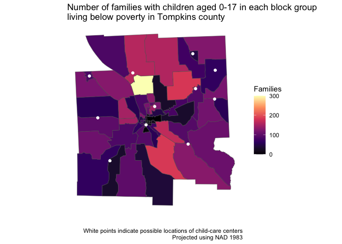

hw-5
================
2023-03-14

## data prep and package loading

after importing the `tomp_poverty.dta` file into our environment, we can
store the block group poverty data for tompkins country as a csv in our
class repo using the following:

``` r
write.csv(tomp_poverty,"tomp_poverty.csv")
print(tomp_poverty)
```

``` r
library(tidyverse)
```

    ## ── Attaching packages ─────────────────────────────────────── tidyverse 1.3.2 ──
    ## ✔ ggplot2 3.4.1      ✔ purrr   0.3.4 
    ## ✔ tibble  3.1.8      ✔ dplyr   1.0.10
    ## ✔ tidyr   1.2.1      ✔ stringr 1.4.1 
    ## ✔ readr   2.1.2      ✔ forcats 0.5.2 
    ## ── Conflicts ────────────────────────────────────────── tidyverse_conflicts() ──
    ## ✖ dplyr::filter() masks stats::filter()
    ## ✖ dplyr::lag()    masks stats::lag()

## q1

### a

first, we need to generate a new variable aggregating the number of
families above and below poverty with children aged 0-17.

``` r
tomp_poverty <- read.csv("tomp_poverty.csv")
```

``` r
tomp_poverty %>% 
  mutate(fkids=fpovkids+fnopovkids)
```

    ##     X   bgroup10 urban fams fpov fnopov fpovkids fnopovkids fkids
    ## 1   1 3.6109e+11     1  136    0    136        0         45    45
    ## 2   2 3.6109e+11     1   15    0     15        0          0     0
    ## 3   3 3.6109e+11     1   19    0     19        0          0     0
    ## 4   4 3.6109e+11     1   18    0     18        0          5     5
    ## 5   5 3.6109e+11     1   33    2     31        0          0     0
    ## 6   6 3.6109e+11     1  103   10     93        5         60    65
    ## 7   7 3.6109e+11     1  424   54    370       54        183   237
    ## 8   8 3.6109e+11     1  236   36    200       27         99   126
    ## 9   9 3.6109e+11     1  433    0    433        0        203   203
    ## 10 10 3.6109e+11     1  380    0    380        0        184   184
    ## 11 11 3.6109e+11     1  210   14    196       14         67    81
    ## 12 12 3.6109e+11     1   36    0     36        0          9     9
    ## 13 13 3.6109e+11     1  306    9    297        0        117   117
    ## 14 14 3.6109e+11     1   75   14     61        7         44    51
    ## 15 15 3.6109e+11     1  337   23    314       23        178   201
    ## 16 16 3.6109e+11     1  153    0    153        0         74    74
    ## 17 17 3.6109e+11     1  253   95    158       85         76   161
    ## 18 18 3.6109e+11     1  223   75    148       56         78   134
    ## 19 19 3.6109e+11     0  394  122    272       88         92   180
    ## 20 20 3.6109e+11     0  325   11    314       11        205   216
    ## 21 21 3.6109e+11     1  207   44    163        7         85    92
    ## 22 22 3.6109e+11     0  388  152    236      152        114   266
    ## 23 23 3.6109e+11     1  153   29    124       29         52    81
    ## 24 24 3.6109e+11     1  129    0    129        0         40    40
    ## 25 25 3.6109e+11     1  253   15    238        0         85    85
    ## 26 26 3.6109e+11     1  148    0    148        0          0     0
    ## 27 27 3.6109e+11     1  518   54    464       34        205   239
    ## 28 28 3.6109e+11     1   21    0     21        0          0     0
    ## 29 29 3.6109e+11     0  513   12    501        0        208   208
    ## 30 30 3.6109e+11     1  205   13    192       13        155   168
    ## 31 31 3.6109e+11     1  161   16    145        0         56    56
    ## 32 32 3.6109e+11     1  126    0    126        0         27    27
    ## 33 33 3.6109e+11     1  139   24    115        0         41    41
    ## 34 34 3.6109e+11     0  234    0    234        0         87    87
    ## 35 35 3.6109e+11     0  326    8    318        8        110   118
    ## 36 36 3.6109e+11     0  396    0    396        0        151   151
    ## 37 37 3.6109e+11     0  430   76    354       76        117   193
    ## 38 38 3.6109e+11     1  486    9    477        0        281   281
    ## 39 39 3.6109e+11     0  772   48    724       48        366   414
    ## 40 40 3.6109e+11     0  286    0    286        0         98    98
    ## 41 41 3.6109e+11     0  350   52    298       49         86   135
    ## 42 42 3.6109e+11     0  446  116    330      116        186   302
    ## 43 43 3.6109e+11     0  539  109    430       97        162   259
    ## 44 44 3.6109e+11     0  431    0    431        0        129   129
    ## 45 45 3.6109e+11     0  336   32    304       32        184   216
    ## 46 46 3.6109e+11     0  472   55    417       45        215   260
    ## 47 47 3.6109e+11     0  423   38    385       38        126   164
    ## 48 48 3.6109e+11     0  278   21    257       21        148   169
    ## 49 49 3.6109e+11     0  283   19    264       19         57    76
    ## 50 50 3.6109e+11     0  447    0    447        0        143   143
    ## 51 51 3.6109e+11     0  631   49    582        0        217   217
    ## 52 52 3.6109e+11     0  491   26    465       15        189   204
    ## 53 53 3.6109e+11     1  388   46    342       40        164   204
    ## 54 54 3.6109e+11     0  284   10    274       10         92   102
    ## 55 55 3.6109e+11     0  379   27    352        0        142   142
    ## 56 56 3.6109e+11     0  392   19    373       19        203   222
    ## 57 57 3.6109e+11     0  335   22    313        7        136   143
    ## 58 58 3.6109e+11     0  495   69    426       69        165   234
    ## 59 59 3.6109e+11     0  494   36    458       36        172   208
    ## 60 60 3.6109e+11     0  292   31    261       24         98   122
    ## 61 61 3.6109e+11     0  441   14    427       10        188   198
    ## 62 62 3.6109e+11     0  632  104    528      104        186   290
    ## 63 63 3.6109e+11     0  596    0    596        0        214   214
    ## 64 64 3.6109e+11     0  326    0    326        0        110   110

with this new variable in place, we can then construct another dividing
the number of families with children below poverty by the total number
of families with children.

``` r
tomp_poverty %>% 
  mutate(fkids=fpovkids+fnopovkids,
         prop_fkids_pov=fpovkids/fkids)
```

    ##     X   bgroup10 urban fams fpov fnopov fpovkids fnopovkids fkids
    ## 1   1 3.6109e+11     1  136    0    136        0         45    45
    ## 2   2 3.6109e+11     1   15    0     15        0          0     0
    ## 3   3 3.6109e+11     1   19    0     19        0          0     0
    ## 4   4 3.6109e+11     1   18    0     18        0          5     5
    ## 5   5 3.6109e+11     1   33    2     31        0          0     0
    ## 6   6 3.6109e+11     1  103   10     93        5         60    65
    ## 7   7 3.6109e+11     1  424   54    370       54        183   237
    ## 8   8 3.6109e+11     1  236   36    200       27         99   126
    ## 9   9 3.6109e+11     1  433    0    433        0        203   203
    ## 10 10 3.6109e+11     1  380    0    380        0        184   184
    ## 11 11 3.6109e+11     1  210   14    196       14         67    81
    ## 12 12 3.6109e+11     1   36    0     36        0          9     9
    ## 13 13 3.6109e+11     1  306    9    297        0        117   117
    ## 14 14 3.6109e+11     1   75   14     61        7         44    51
    ## 15 15 3.6109e+11     1  337   23    314       23        178   201
    ## 16 16 3.6109e+11     1  153    0    153        0         74    74
    ## 17 17 3.6109e+11     1  253   95    158       85         76   161
    ## 18 18 3.6109e+11     1  223   75    148       56         78   134
    ## 19 19 3.6109e+11     0  394  122    272       88         92   180
    ## 20 20 3.6109e+11     0  325   11    314       11        205   216
    ## 21 21 3.6109e+11     1  207   44    163        7         85    92
    ## 22 22 3.6109e+11     0  388  152    236      152        114   266
    ## 23 23 3.6109e+11     1  153   29    124       29         52    81
    ## 24 24 3.6109e+11     1  129    0    129        0         40    40
    ## 25 25 3.6109e+11     1  253   15    238        0         85    85
    ## 26 26 3.6109e+11     1  148    0    148        0          0     0
    ## 27 27 3.6109e+11     1  518   54    464       34        205   239
    ## 28 28 3.6109e+11     1   21    0     21        0          0     0
    ## 29 29 3.6109e+11     0  513   12    501        0        208   208
    ## 30 30 3.6109e+11     1  205   13    192       13        155   168
    ## 31 31 3.6109e+11     1  161   16    145        0         56    56
    ## 32 32 3.6109e+11     1  126    0    126        0         27    27
    ## 33 33 3.6109e+11     1  139   24    115        0         41    41
    ## 34 34 3.6109e+11     0  234    0    234        0         87    87
    ## 35 35 3.6109e+11     0  326    8    318        8        110   118
    ## 36 36 3.6109e+11     0  396    0    396        0        151   151
    ## 37 37 3.6109e+11     0  430   76    354       76        117   193
    ## 38 38 3.6109e+11     1  486    9    477        0        281   281
    ## 39 39 3.6109e+11     0  772   48    724       48        366   414
    ## 40 40 3.6109e+11     0  286    0    286        0         98    98
    ## 41 41 3.6109e+11     0  350   52    298       49         86   135
    ## 42 42 3.6109e+11     0  446  116    330      116        186   302
    ## 43 43 3.6109e+11     0  539  109    430       97        162   259
    ## 44 44 3.6109e+11     0  431    0    431        0        129   129
    ## 45 45 3.6109e+11     0  336   32    304       32        184   216
    ## 46 46 3.6109e+11     0  472   55    417       45        215   260
    ## 47 47 3.6109e+11     0  423   38    385       38        126   164
    ## 48 48 3.6109e+11     0  278   21    257       21        148   169
    ## 49 49 3.6109e+11     0  283   19    264       19         57    76
    ## 50 50 3.6109e+11     0  447    0    447        0        143   143
    ## 51 51 3.6109e+11     0  631   49    582        0        217   217
    ## 52 52 3.6109e+11     0  491   26    465       15        189   204
    ## 53 53 3.6109e+11     1  388   46    342       40        164   204
    ## 54 54 3.6109e+11     0  284   10    274       10         92   102
    ## 55 55 3.6109e+11     0  379   27    352        0        142   142
    ## 56 56 3.6109e+11     0  392   19    373       19        203   222
    ## 57 57 3.6109e+11     0  335   22    313        7        136   143
    ## 58 58 3.6109e+11     0  495   69    426       69        165   234
    ## 59 59 3.6109e+11     0  494   36    458       36        172   208
    ## 60 60 3.6109e+11     0  292   31    261       24         98   122
    ## 61 61 3.6109e+11     0  441   14    427       10        188   198
    ## 62 62 3.6109e+11     0  632  104    528      104        186   290
    ## 63 63 3.6109e+11     0  596    0    596        0        214   214
    ## 64 64 3.6109e+11     0  326    0    326        0        110   110
    ##    prop_fkids_pov
    ## 1      0.00000000
    ## 2             NaN
    ## 3             NaN
    ## 4      0.00000000
    ## 5             NaN
    ## 6      0.07692308
    ## 7      0.22784810
    ## 8      0.21428571
    ## 9      0.00000000
    ## 10     0.00000000
    ## 11     0.17283951
    ## 12     0.00000000
    ## 13     0.00000000
    ## 14     0.13725490
    ## 15     0.11442786
    ## 16     0.00000000
    ## 17     0.52795031
    ## 18     0.41791045
    ## 19     0.48888889
    ## 20     0.05092593
    ## 21     0.07608696
    ## 22     0.57142857
    ## 23     0.35802469
    ## 24     0.00000000
    ## 25     0.00000000
    ## 26            NaN
    ## 27     0.14225941
    ## 28            NaN
    ## 29     0.00000000
    ## 30     0.07738095
    ## 31     0.00000000
    ## 32     0.00000000
    ## 33     0.00000000
    ## 34     0.00000000
    ## 35     0.06779661
    ## 36     0.00000000
    ## 37     0.39378238
    ## 38     0.00000000
    ## 39     0.11594203
    ## 40     0.00000000
    ## 41     0.36296296
    ## 42     0.38410596
    ## 43     0.37451737
    ## 44     0.00000000
    ## 45     0.14814815
    ## 46     0.17307692
    ## 47     0.23170732
    ## 48     0.12426036
    ## 49     0.25000000
    ## 50     0.00000000
    ## 51     0.00000000
    ## 52     0.07352941
    ## 53     0.19607843
    ## 54     0.09803922
    ## 55     0.00000000
    ## 56     0.08558559
    ## 57     0.04895105
    ## 58     0.29487179
    ## 59     0.17307692
    ## 60     0.19672131
    ## 61     0.05050505
    ## 62     0.35862069
    ## 63     0.00000000
    ## 64     0.00000000

we can then group by urbanicity to see how the proportions for each
block group vary by designation:

``` r
tomp_poverty %>% 
  mutate(fkids=fpovkids+fnopovkids,
         prop_fkids_pov=fpovkids/fkids) %>%
  group_by(urban) %>%
  summarize(povrate_fkids=mean(prop_fkids_pov,na.rm=TRUE))
```

    ## # A tibble: 2 × 2
    ##   urban povrate_fkids
    ##   <int>         <dbl>
    ## 1     0         0.155
    ## 2     1         0.105

based on these results, we can see that the mean poverty rate among
families with children is greater in rural areas (0.155 \[3sf\]) than
urban areas (0.105 \[3sf\]). however, from my one-tailed t-test, this
difference appears to be insignificant (p=0.115\[3sf\]). poverty in
tompkins county therefore appears to impact a relatively equal share of
rural and urban families with children.

we can run a similar analysis for all families (i.e., not just those
with children aged 0-17):

``` r
tomp_poverty %>% 
  mutate(prop_f_pov=(fpov+fpovkids)/fams) %>%
  group_by(urban) %>%
  summarize(povrate_f=mean(prop_f_pov,na.rm=TRUE)) 
```

    ## # A tibble: 2 × 2
    ##   urban povrate_f
    ##   <int>     <dbl>
    ## 1     0     0.166
    ## 2     1     0.132

again, we see that families living in rural areas tend to experience
poverty at a greater rate than families living in urban areas, though
the difference does not appear to be significant (p=0.749\[3sf\]).

### b

``` r
tomp_poverty %>% 
  mutate(tot_fpovkids=sum(fpovkids),
         tot_fnopovkids=sum(fnopovkids),
         di=abs(fpovkids/tot_fpovkids - fnopovkids/tot_fnopovkids)) %>%
  summarize(dissim=sum(di)/2)
```

    ##      dissim
    ## 1 0.4949007

when comparing families with children aged 0-17 who are living below
poverty and families with children aged 0-17 who are not, we observed a
dissimilarity index of 0.495 (3sf). this suggests that approximately
half of all families with children living below poverty would need to
change residence to create a more uniform distribution across block
groups. because the index rangrs from 0.0 to 1.0, signifying complete
integration and complete segregation, respectively, this index value
appears to suggest that theire is a medium level of segregation.

### c

acs data are subject to errors in sampling, and the resulting biases
from these errors are magnified when we use these data to observed
phenomena at small spatial scales.

in addition to this scaling issue, there are also issues in the
reliability of acs survey results, with patterned variation occurring
across different surveys.

## q2

loading in necessary packages:

``` r
library(tidycensus)
options(tigris_use_cache=TRUE)
```

loading in point data:

``` r
write.csv(tomp_sites,"tomp_sites.csv")
print(tomp_sites)
```

``` r
tomp_sites <- read.csv("tomp_sites.csv")
```

### a

``` r
tompkins <- get_acs(
  state = "NY",
  county = "Tompkins",
  geography = "cbg",
  variables = "B11003_003",
  geometry = TRUE,
  year = 2016
)
```

    ## Getting data from the 2012-2016 5-year ACS

    ## Warning: • You have not set a Census API key. Users without a key are limited to 500
    ## queries per day and may experience performance limitations.
    ## ℹ For best results, get a Census API key at http://api.census.gov/data/
    ## key_signup.html and then supply the key to the `census_api_key()` function to
    ## use it throughout your tidycensus session.
    ## This warning is displayed once per session.

``` r
ggplot() + 
  geom_sf(data=tompkins,aes(fill=estimate)) + 
  geom_point(data=tomp_sites,aes(x=xlon,y=ylat),color="white") +
  scale_fill_viridis_c(option="magma") +
  xlab("") + 
  ylab("") +
  labs(fill="Families",caption="White points indicate possible locations of child-care centers\n Projected using NAD 1983") +
  ggtitle("Number of families with children aged 0-17 in each block group \nliving below poverty in Tompkins county") + 
  theme(axis.ticks=element_blank(),axis.text=element_blank(),panel.background=element_rect(fill=NA))
```

<!-- -->
